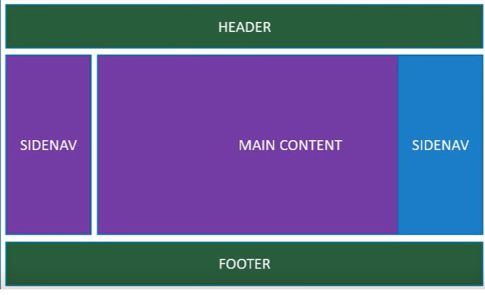

# React e sua história

O React (também chamado de React.js ou ReactJS) é uma biblioteca JavaScript criada pelo Facebook em 29 de Maio de 2013, com o intuito de facilitar e aprimorar o desenvolvimento de interfaces de usuário no ambiente da web. Após a sua criação, a biblioteca ficou rapidamente popular, alcançando o 3º lugar na lista de bibliotecas/frameworks mais populares de JavaScript, ficando atrás apenas do Angular (outra biblioteca frontend) e NodeJs (Server-side JavaScript).

Atualmente, o React é utilizado por gigantes do mercado tech, como Airbnb, Netflix, Twitter, entre outras empresas de grande porte.

(Spoiler: aqui na Dygital Code utilizamos React também!)

Mas, o que faz o React ser tão popular? Neste capítulo introdutório, iremos explorar os pilares que fazem do React uma ferramenta tão poderosa e tão querida e utilizada pelos desenvolvedores Front-End.

## Declarativo

"Programação declarativa" é um paradigma de programação baseado em programação funcional. É um tipo de paradigma existente em linguagens de alto nível que consiste em um entendimento simplificado da máquina sobre o que o código deve fazer, sem que seja necessário um nível de detalhamento complexo sobre as instruções.

Em outras palavras, não há preocupação na maneira ou método de execução de uma determinada rotina, pois o foco não está no “como” e sim no “que” será feito.

O oposto da programação declarativa é a programação imperativa: onde é necessário instruir passo-a-passo, minunciosamente a rotina dada. Na programação imperativa, você tem código procedural e também todos os diferentes tipos de programação orientada a objetos. A programação declarativa é representada por linguagens específicas de domínio, linguagens lógicas e programação funcional.

Não existe um tipo de paradigma superior ao outro, mas alguns são melhor aplicáveis em determinadas situações. No Front-End e renderização de interfaces, códigos declarativos são mais fáceis de ler e tornam o processo de desenvolvimento mais simplificado.

## Arquitetura Baseada em Componentes

React utiliza a Componentização para renderizar os elementos da interface de uma página. Esses "componentes" são encapsulados e possuem sua própria lógica e estado, podendo funcionar de forma independente dos outros componentes, e, a critério do programador, funcionar também em conjunto. A combinação de componentes permite a criação de interfaces cada vez mais complexas.

## DOM Virtual

Em React, O DOM original é representado por um DOM virtual, armazenado dentro da memória do React. Essa característica ajuda a acelerar o processo de desenvolvimento de aplicativos e oferece flexibilidade.

Sempre que a interface é modificada ou atualizada (exemplo: um usuário clica em um componente), toda a interface do usuário é renderizada novamente pelo DOM virtual, atualizando APENAS os componentes que foram modificados. Isso reduz drasticamente o tempo e o custo de desenvolvimento.

## JavaScript JSX

O JSX é uma sintaxe de marcação semelhante ao HTML (MAS NÃO É HTML!) que foi criado pelo Facebook para facilitar a criação da interface do aplicativo e seus componentes.

JSX é um dos melhores recursos do React JS, pois torna super fácil para os desenvolvedores escreverem os blocos de construção. É uma vantagem que o React possui sobre os outros frameworks Front-End como Vue e Angular.

Exemplo de código JSX:

Lembrando que, apesar da semelhança (com fins de facilitar a vida do desevolvedor), JSX não é HTML.

## Curva de Aprendizado Pequena

Quando comparada ao Angular, o React é uma lib muito mais simples de dominar. A sua simplicidade faz com que até programadores no início das suas carreiras possam aprender o básico e evoluir exponencialmente dali em diante. Mas atenção: ainda é necessário ter um domínio intermediário de JavaScript antes de mergulhar no React!

## Milhares de recursos disponíveis

Por ser tão popular, é muito fácil encontrar diversas bibliotecas e componentes pré-feitos em React. As bibliotecas de UI mais populares do mercado, como Bootstrap, Tailwind CSS e Material UI, possuem suas versões para React, abraçando as características de componentização e arquitetura.

React também possui suporte interno para TypeScript.

## Constantemente atualizado

O React é mantido pelo Facebook, uma das maiores empresas de tecnologia da atualidade. Isso significa que há um suporte gigantesco por trás da biblioteca. Todos os anos o React é atualizado, trazendo novidades e melhorias. Um exemplo disso foi a introdução dos Hooks, introduzidos em 2019, que mudou drasticamente (PRA MELHOR) a forma como se desenvolve interfaces com React.

### Conclusão

Há inúmeras vantagens em escolher o React como ferramenta para desenvolvimento Front-End e os pilares citados acima são apenas as principais delas. Durante o curso iremos explorar o React á fundo e você se tornará um desenvolvedor Front-End desejado pelo mercado. Vamos para a próxima aula?

#### Referências



{% embed url="https://medium.com/@alexandre.malavasi/descomplicando-programa%C3%A7%C3%A3o-imperativa-declarativa-e-reativa-a481baa87742" %}


