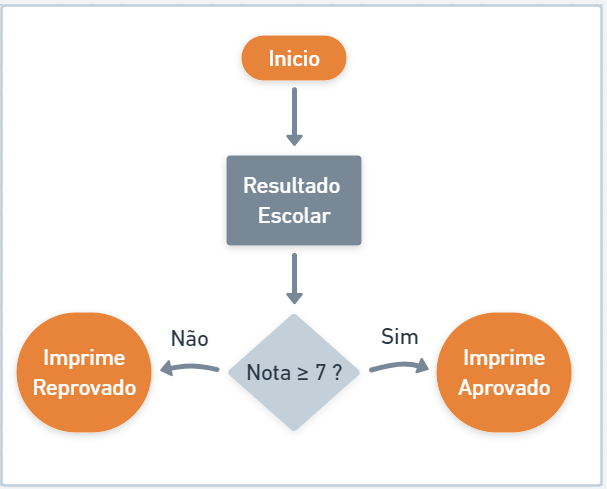

# Estruturas condicionais

A Estrutura Condicional possibilita a escolha de um grupo de ações e comportamentos a serem executadas quando determinadas condições são ou não satisfeitas. A Estrutura Condicional pode ser **Simples** ou **Composta**.

## Condicionais Simples

Quando ocorre uma validação de execução de fluxo somente quando a condição for positiva, consideramos como uma estrutura **Simples**, exemplo:

.png>)

```java
// CaixaEletronico.java
public class CaixaEletronico {
    public static void main(String[] args) {

       double saldo = 25.0;
       double valorSolicitado = 17.0;

       if(valorSolicitado < saldo)
        saldo = saldo - valorSolicitado;

        System.out.println(saldo);

    }
}
```

## Condicionais Composta

Algumas vezes o nosso programa deverá seguir mais de uma jornada de execução condionado a uma regra de negócio, este cenário é demoninado **Estrutura Composto**. Vejamos o exemplo abaixo:



```java
// ResultadoEscolar.java
public class ResultadoEscolar {
    public static void main(String[] args) {

       int nota = 6;
       
       if(nota >= 7)
        System.out.println("Aprovado");

       else
        System.out.println("Reprovado");
    }
}
```


Vale ressaltar aqui que no Java um bloco **`if/else`** as vezes necessita de adicionar um bloco de **`{ }`**se a lógica conter mais de uma linha.


## Condicionais encadeadas

Em um controle de fluxo condicional, nem sempre nos limitamos ao **se** (`if`) e **senão** (`else`), poderemos ter uma terceira, quarta e ou inúmeras condições.

.png>)

```java
// ResultadoEscolar.java
public class ResultadoEscolar {
    public static void main(String[] args) {
        int nota = 6;

	if (nota >= 7)
		System.out.println("Aprovado");
	else if (nota >= 5 && nota < 7)
		System.out.println("Recuperação");
	else
		System.out.println("Reprovado");
    }
}
```

## Condição ternária

Como vimos em operadores, podemos abreviar nosso algorítmico condicional refatorando com o conceito de operador ternário. Vamos refatorar os exemplos acima para ilustrar o poder deste recurso:&#x20;

```java
// Cenário 1
public class ResultadoEscolar {
	public static void main(String[] args) {
		int nota = 7;
		String resultado = nota >=7 ? "Aprovado" : "Reprovado";
		System.out.println(resultado);
	}
}
```

```java
// Cenário 2
public class ResultadoEscolar {
	public static void main(String[] args) {
		int nota = 6;
		String resultado = nota >=7 ? "Aprovado" : nota >=5 && nota <7 ? "Recuperação" : "Reprovado";
		System.out.println(resultado);
	}
}

```

#### Referências




