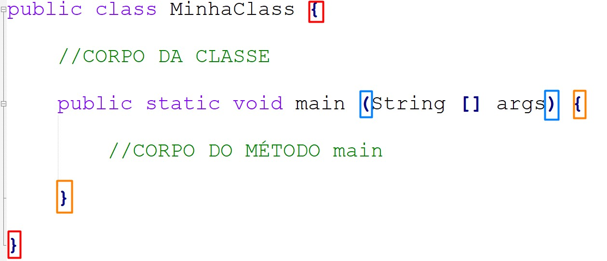

# Anatomia das classes

* 99,9% das nossas classes iniciarão com **`public class`**.
* Toda classe precisa de nome, exemplo **`MinhaClasse`**.
* Após o nome, precisamos definir o corpo `{ }` onde iremos compor nossas classes com atributos e métodos.

* É de suma importância, que agora você consiga se localizar,dentro do conjunto de chaves **`{ }`** existentes em sua classe.
* &#x20;Dentro de uma aplicação, recomenda-se que somente uma classe possua o método **`main`**, responsável por iniciar todo o nosso programa.
* O método main recebe seu nome **`main`**, sempre terá a visibilidade **`public`**, será definido como **`static`**, não retornará nenhum valor com **`void`**`,`e receberá um parâmetro do tipo array de caracteres **`String[]`**.

