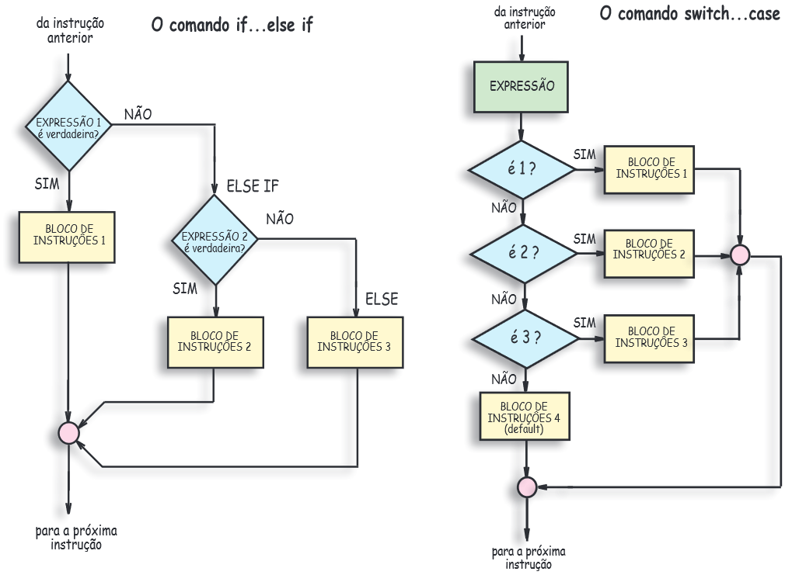

# Controle de fluxo

Controle de fluxo, é a habilidade de ajustar a maneira como um programa realiza suas tarefas. Por meio de instruções especiais, chamadas de comandos, essas tarefas podem ser executadas seletivamente, repetidamente ou excepcionalmente.



#### Classificação:&#x20;

* **Fluxo de decisão**: if-else, switch-case.&#x20;
* **Laços ou repetições** : for, while, do-while .
* **Exceções**: try-catch-finally, throw.

## Fluxo de decisão

Todo processo, contém alternativas de fluxo que, diante de um estado condicional lógico (verdadeira / falso), a execução é direcionada.&#x20;

Na linguagem Java, existem duas estruturas de fluxo de decisão ou controle de fluxo condicional, que são: `if-else` e `switch-case`. &#x20;

### if-else

Corresponde a capacidade de alterar o fluxo de um processo, baseando-se em uma condição lógica, exemplo:

Vamos imaginar que, em um processo seletivo existe o valor base salarial e o salário sugerido pelo candidato. Vamos elaborar um controle de fluxo onde:&#x20;

1. Se o valor base salarial for maior ou igual ao salário sugerido pelo candidato, imprima: **LIGAR PARA O CANDIDATO;**&#x20;
2. Caso contrário, imprima: **AGUARDANDO RESULTADO DOS DEMAIS CANDIDATOS**.&#x20;

```java
public class ProcessoSeletivo {
	public static void main(String[] args) {
		double salarioBase = 5000.0;
		double salarioSugerido = 6000.0;
		if(salarioBase >= salarioSugerido) {
			System.out.println("LIGAR PARA O CANDIDATO");
		}else {
			System.out.println("AGUARDANDO RESULTADO DOS DEMAIS CANDIDATOS");
		}
	}
}
```

Claro que nem sempre uma decisão é baseada somente a duas alternativas (if-else). É ai que entra o bloco condicional intermediário (else if) **contemplando** as alternativas presentes, da definição de regra de negócio.

Vamos mudar um pouco nosso requisito conforme abaixo:

1. Se o valor salário base, for maior que valor salário sugerido, imprima : **LIGAR PARA O CANDIDATO**;
2. Senão, Se o valor salário base, for igual ao valor salário sugerido, imprima : **LIGAR PARA O CANDIDATO COM CONTRA PROPOSTA**;
3. Senão imprima: **AGUARDANDO RESULTADO DOS DEMAIS CANDIDATOS**




Revise sobre controle de fluxo, if else e operadores lógicos em Java.




```java
public class ProcessoSeletivo {
public static void main(String[] args) {
	double salarioBase = 5000.0;
	double salarioSugerido = 5000.0;
	if(salarioBase > salarioSugerido) {
		System.out.println("LIGAR PARA O CANDIDATO");
	}else if (salarioBase == salarioSugerido) {
		System.out.println("LIGAR PARA O CANDIDATO COM CONTRA PROPOSTA");
	}else {
		System.out.println("AGUARDANDO RESULTADO DOS DEMAIS CANDIDATOS");
		
	}
}
}
```



## Laços de repetições

Laços de repetição, também conhecidos como laços de iteração ou simplesmente loops, são comandos que permitem iteração de código, ou seja, que comandos presentes no bloco, sejam repetidos diversas vezes.

### for

O comando `for` , (na tradução literal para a língua portuguesa **para**) permite que uma variável contadora, seja testada e incrementada a cada iteração, sendo essas informações definidas na chamada do comando. O comando **for**, recebe como entrada uma variável contadora, a condição e o valor que será incrementado.

Veja a estrutura do **for** na linguagem Java:

```java
for(int x=0; x<5;x++) {
			
    //este comportamento será executado 5 vezes, 5 - 0 = 5;

}
```

* **int x = 0:** iniciamos uma variável de nome `x` com valor inicial a 0, este bloco executa uma vez;
* **x < 5:** Aqui é a condição que determina quantas vezes o processo será executado;
* **x++:** Este bloco realiza ao final do fluxo de execução, a incrementação em +1 a variável `x.`

### for-each

Na maioria das linguagens, o comando **for** , contém uma segunda estrutura `for-each` (para cada elemento) que percorre todos os itens de um vetor, atualizando a variável inicial.

Veja a estrutura do **for** na linguagem Java:

```java
int [] numeros = {0,1,2,3,4}; //vetor de números inteiros
		
for (int numero: numeros) {
    System.out.println(numero);
    //fim do processo
}
```

* **int \[] numeros:** Variável que representa um vetor (array), de inteiros, podendo ser qualquer tipo;
* **int numero:** Variável temporária, que receberá cada elemento, antes de cada ocorrência;

## while

O laço `while` (na tradução literal para a língua portuguesa **enquanto**), avalia que, enquanto uma determinada condição for válida, o bloco de código será executado. O **while** testa a condição, antes de executar o código, assim sendo, caso a condição seja inválida no primeiro teste, o bloco nem é executado.

Vamos incrementar o nosso sistema de processo seletivo, considerando um novo requisito.

Foi solicitado, que nosso sistema garanta que, diante das inúmeras candidaturas sejam selecionados apenas 5 candidatos para entrevista.

```java
String [] candidatos = {"FELIPE","MÁRCIA","JULIA","PAULO","AUGUSTO","MÔNICA","FABRíCIO","MIRELA","DANIELA","JORGE"};
		
int selecionados=0;

while (selecionados<5) {

	System.out.println(candidatos[selecionados] + " FOI SELECIONADO PARA A ENTREVISTA");
	selecionados++;

}

System.out.println("TOTAL DE SELECIONADOS " + selecionados);
```

## do-while

O laço `do-while` (na tradução literal para a língua portuguesa **faça enquanto**), assim como o laço `while`, determina que, enquanto uma determinada condição for válida, o bloco de código será executado. Entretanto, `do-while` testa a condição após executar o código, assim sendo, mesmo que a condição seja considerada inválida, no primeiro teste, o bloco será executado pelo menos uma vez.

```java
public static void main(String[] args) {
	int tentativasRealizadas = 1;
	boolean sucesso = false;
	do {
		sucesso = novaTentativa();
		if(sucesso)
			System.out.println("CONTATO REALIZADO COM SUCESSO");
		else
			tentativasRealizadas++;
		
	}while(!sucesso && tentativasRealizadas<3);
	
	if(sucesso)
		System.out.println("CONSEGUIMOS CONTATO COM FULANO NA " + tentativasRealizadas + " TENTATIVA");
	else
		System.out.println("NÃO CONSEGUIMOS CONTATO COM FULANO, NÚMERO MAXIMO TENTATIVAS " + tentativasRealizadas + " REALIZADA");
	
}
//método auxiliar
static boolean novaTentativa() {
	return new Random().nextInt(2)!=1;	
}
```

#### &#x20;Desafio

**Processo Seletivo:** vamos elaborar um sistema que realize a contratação de candidatos, comparação salarial entre a vaga versus valor solicitado pelos candidatos, adicionar os candidatos, em um vetor de acordo com as regras aplicadas e em seguida simular o contato telefônico, para cada um dos candidatos selecionados.

1. A vaga em questão é, desenvolvedor júnior, salário máximo de R$ 2.500,00;
2. Criar a classe e um objeto candidato com nome, email, telefone e pretensão salarial, com base nos integrantes do grupo, se for menor que 3 adicionar dados fictícios.
3. Percorrer todos os candidatos exibindo a seguinte mensagem: **CANDIDATO EM NOSSA BASE DE DADOS - \[NOME DO CANDIDATO];**
4. Se o valor do salário pretendido, for menor ou igual ao salário base, o candidato deve ser adicionado ao vetor de candidatos;
5. O vetor de candidatos deverá ser de no máximo 3;
6. Imprima o vetor dos candidatos selecionados, com a seguinte mensagem: **\[NOME DO CANDIDATO] - SELECIONADO PARA ENTREVISTA**;
7. O candidato que tiver o menor salário,pretendido, será o candidato que tentaremos manter o contato por telefone com 3 tentativas.
8. O código deverá estar disponível no Github **mjv-java-dezembro21** de cada integrante.

Dicas:

* Pesquise sobre arrays na linguagem Java;
* Pesquise sobre objetos, atributos e métodos na linguagem Java;
* Revise os vídeos e tópicos citados anteriormente;
* Exercite a habilidade de lógica e algoritimo.

#### Referências




