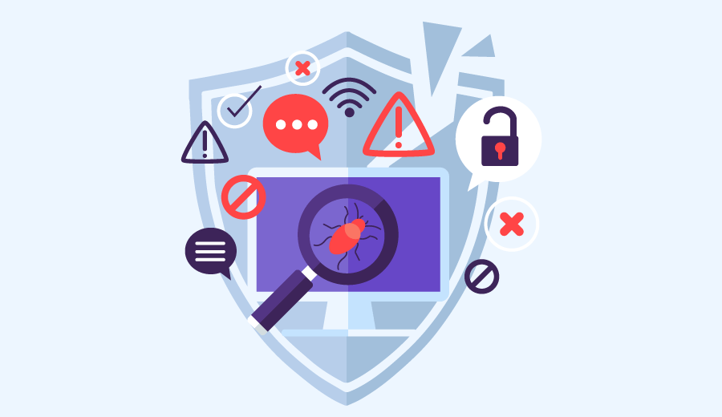

# Debug

Acompanhar o estado de nossos objetos, o valor das nossas variáveis e até aonde o nosso programa está executado sem erros, é algo extremamente importante para garantir a integridade do algoritmo implementado.

O termo Debug deriva da expressão "procurar e remover insetos", termo este utilizado devido localização de uma mariposa **(Bug)** presa no relé em um dos grandes computadores da época como o Mark II de Harvard, ocasionando assim falhas no processo.

Todas as IDEs, possuem um recurso de acompanhamento de código, denominado de **breakpoint** e antes de iniciar a implementação de algoritmos complexos, é de suma importância dominar os comandos do debug.

Abaixo, temos uma ilustração dos comandos relacionados a debug utilizando a IDE Eclipse.

Primeiro, inicie o seu programa em modo **debug**.

Em seguida, você deve clicar na linha que gostaria de "segurar" a execução, denominamos esta ação de breakpoints.

.jpg>)

1. **Funcionalidade de Resume (F8)** – Avança para o próximo Breakpoint do código. Caso não tenha próximo, avança até o fim da execução do software.
2. **Funcionalidade de Terminate (Ctrl + F2)** – Finaliza a execução do software, independente de onde esteja.
3. **Funcionalidade de Step Into (F5)** – Entra um método, que exista na linha da execução. Muito importante para saber onde o sistema está indo.
4. **Funcionalidade de Step Over (F6)** – Avança para a próxima linha de código, dentro da mesma _classe_ que está em execução.
5. **Funcionalidade de Step Return (F7)** – Volta para o método anterior. Fácil de ser verificado pela stack de execução.


Depurar o código, é a capacidade de prevê o resultado da execução.


#### Referências





&#x20;
