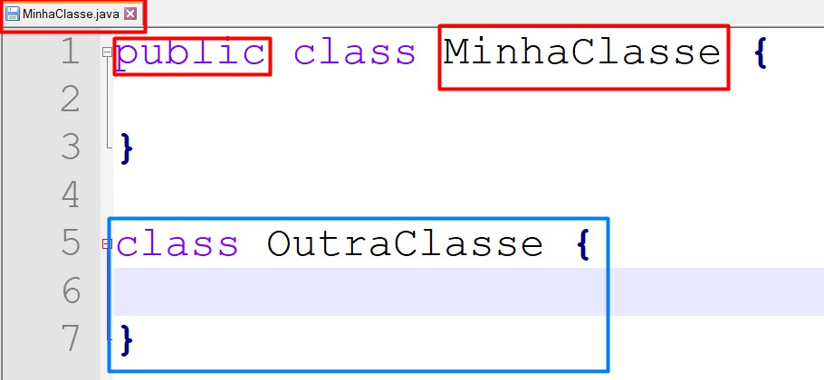

# Java Beans

Umas das maiores dificuldades na programação é escrever algoritmos legíveis, a níveis que sejam compreendidos por todo seu time ou por você mesmo no futuro. Para isso, a linguagem Java sugere através de convenções, formas de escrita universal, para nossas classes, atributos, métodos e pacotes.

## Classes

Uma classe em Java deve seguir o seguinte padrão:

* O nome da classe _pública_ deve igual ao nome do **arquivo.java**;
* Toda classe deve começar com letra maiúscula e se for uma palavra composta, A letra inicial de cada palavra, deverá também ser maiúscula, exemplo: **MinhaClasse**;
* Um arquivo.java poderá ter várias classes, mas somente a classe de mesmo nome, deverá ser `public.`Não recomendamos ter mais de uma classe em um arquivo.java.



## Variáveis

O nome de uma variável, se formado por uma única palavra, deve ser declarado inteiramente em minúsculo. No caso de palavras compostas, apenas a primeira letra de cada palavra, a partir da segunda palavra, deve estar em maiúsculo. Não é muito recomendado, mas se necessário, usar números ou caracteres especiais em uma variável você deve se estender a estas regras:

* Uma variável não pode iniciar com número;
* Uma variável só pode conter os caracteres: "\_ "(underline) e "$" (cifrão);
* Uma variável não ter o nome de uma palavra reservada;
* Uma variável não pode conter espaços;
* Uma variável que representa um conjunto de valores, como array ou coleção, deve estar no formato de plural;
* Todavia, variáveis cujo nome tenha apenas um caractere, deve ser evitado, com exceção de variáveis temporárias, utilizadas em laços de repetição, onde geralmente usamos i, j ou k.

#### Variáveis válidas

```
int um = 1;
int numeroUm = 1;
int _numeroUm = 1;
int $um = 1;
int [] numeros = {1,2,3} // ver conceito de arrays
```

#### Variáveis inválidas

```
int 1 = 1;
int 1um = 1;
int %um = 1;
int numero um = 1;
```

#### CONSTANTES

Nós já aprendemos no tópico [Tipos, variáveis e constantes](tipos-variaveis-e-constantes.md#variaveis-e-constantes), que existem dois tipos de variáveis, as que podemos alterar o seu valor e as que seu valor não pode ser modificado e as que denominamos de constante.

Um exemplo comum, é determinar a média mínima de aprovação de alunos de uma escola, como valor 7. A nota dos alunos serão modificadas, mas o valor da média mínima não. Tornando esta variável final. Nós conseguimos garantir que seu valor, não será modificado, e para explicitar esta regra, nós utilizamos o padrão onde todo o nome da variável, será composta por letra maiúscula.

```java
public class NotaFinal {
	public static void main(String[] args) {
		int notaUm   	= 8;
		int notaDois 	= 7;
		int notaTres 	= 6;
		int notaQuatro	= 9;
		
		int mediaFinal	= (notaUm + notaDois + notaTres + notaQuatro) / 4;
		
		int final NOTA_MINIMA = 7;
		
		if(mediaFinal >=NOTA_MINIMA)
			System.out.println("Aprovado");
		else
			System.out.println("Reprovado");
		
	}
}
```


O que determina se uma variável não pode ser alterada, é a palavra reservada **final**, o fato da variável ser totalmente maiúscula é uma adoção das boas práticas de escrita em Java.&#x20;


## Métodos

Os métodos, deverão ser nomeados com verbos, através de uma mistura de letras minúsculas e maiúsculas. Em princípio, todas as letras que compõem o nome devem ser mantidas em minúsculo, com exceção, a primeira letra, da segunda palavra composta.

Exemplos sugeridos para nomenclatura de métodos:

```java
somar(int n1, int n2){}

abrirConexao(){}

concluirProcessamento() {}

findById(int id){} // não se assuste, você verá muito método em inglês em sua jornada

calcularImprimir(){} // há algo de errado neste método, ele deveria ter uma única finalidade

```

## Getters e Setters

É comum, nossos objetos terem atributos ou características, que podem ser definidos ou obtidos os seus valores/estado através da instância de um objeto.

Vamos ver o código abaixo, da criação de um objeto Aluno, com nome e idade:

```java
//arquivo Aluno.java
public class Aluno {
	String nome;
	int idade;
}

//arquivo Escola.java
public class Escola {
	public static void main(String[] args) {
		Aluno felipe = new Aluno();
		felipe.nome="Felipe";
		felipe.idade = 8;
		
		System.out.println("O aluno " + felipe.nome + " tem " + felipe.idade + " anos ");
		//RESULTADO NO CONSOLE
		//O aluno Felipe tem 8 anos 		
	}
}
```

Seguindo a convenção Java Beans, uma classe que contém esta estrutura de estados, deverá seguir as regras abaixo:

* Os atributos precisam ter o modificador de acesso `private`. Ex.: private String nome;
* Como agora os atributos estarão somente a nível de classe, precisaremos dos métodos **get**X e **set**X, Ex.: getNome() e setNome(String novoNome);
* O método **get,** é responsável por obter o valor atual do atributo, logo, ele precisa ser `public` e retornar um tipo correspondente ao valor, Ex.: `public String getNome() {}`;
* O método **set,** é responsável por definir ou modificar o valor de um atributo, em um objeto, logo, ele também precisa ser `public`, receber um parâmetro do mesmo tipo da variável, mas não retorna nenhum valor void. Ex.: `public void setNome(String newNome)`;

```java
//arquivo Aluno.java
public class Aluno {
	private String nome;
	private int idade;
	
	public String getNome() {
		return nome;
	}
	public void setNome(String newNome) {
		nome = newNome;
	}
	public int getIdade() {
		return idade;
	}
	public void setIdade(int newIdade) {
		this.idade = newIdade;
	}
}
//arquivo Escola.java
public class Escola {
	public static void main(String[] args) {
		Aluno felipe = new Aluno();
		felipe.setNome("Felipe");
		felipe.setIdade(8);
		
		System.out.println("O aluno " + felipe.getNome() + " tem " + felipe.getIdade() + " anos ");	
	}
}
```


A proposta do código acima é a mesma que o código anterior, a diferença é que adotamos a convenção Java Beans, para definir e obter as características dos nossos objetos.


Uso do `this` no método set. É muito comum vermos nossos métodos de definição, ter a seguinte sintaxe:

```java
//arquivo Aluno.java
private String nome;

public void setNome(String nome) {
	this.nome = nome;
}
```


Observe que, a descrição do nosso atributo `nome` é igual a descrição do parâmetro, logo, utilizamos mais uma palavra reservada `this` para distinguir um do outro. Para mais detalhes veja [Palavras Reservadas](palavras-reservadas.md).


## **S.O.L.I.D: Os 5 princípios da POO** <a href="#faf1" id="faf1"></a>

SOLID são cinco princípios da programação orientada a objetos, que facilitam no desenvolvimento de softwares, tornando-os fáceis de manter e estender. Esses princípios podem ser aplicados a qualquer linguagem de POO.

1. &#x20;**S  — Single Responsiblity Principle** (Princípio da responsabilidade única)
2. **O — Open-Closed Principle** (Princípio Aberto-Fechado)
3. **L — Liskov Substitution Principle** (Princípio da substituição de Liskov)
4. &#x20;**I  — Interface Segregation Principle** (Princípio da Segregação da Interface)
5. **D — Dependency Inversion Principle** (Princípio da inversão da dependência)

Nesta etapa, iremos abordar inicialmente o princípio da Responsabilidade Única.

**Uma classe deve ter um, e somente um, motivo para mudar.**

Esse princípio declara que, uma classe deve ser especializada em um único assunto e possuir apenas uma responsabilidade dentro do software, ou seja, a classe deve ter uma única tarefa ou ação para executar.

&#x20;Você pode incentivar a criação de novos conteúdos contribuindo com um cafézinho! 🎁☕😊


#### Referências

{% embed url="https://www.frameworkdemoiselle.gov.br/wikie0c3.html?_54_INSTANCE_22yPPz0LwGHG_nodeName=Main&_54_INSTANCE_22yPPz0LwGHG_struts_action=%2Fwiki_display%2Fview&_54_INSTANCE_22yPPz0LwGHG_title=Conven%C3%A7%C3%A3o+desenvolvedor%2FConven%C3%A7%C3%A3o+c%C3%B3digo%2FJava&p_p_col_count=2&p_p_col_id=column-1&p_p_col_pos=1&p_p_id=54_INSTANCE_22yPPz0LwGHG&p_p_lifecycle=0&p_p_mode=view&p_p_state=normal" %}

{% embed url="https://medium.com/desenvolvendo-com-paixao/o-que-%C3%A9-solid-o-guia-completo-para-voc%C3%AA-entender-os-5-princ%C3%ADpios-da-poo-2b937b3fc530" %}
