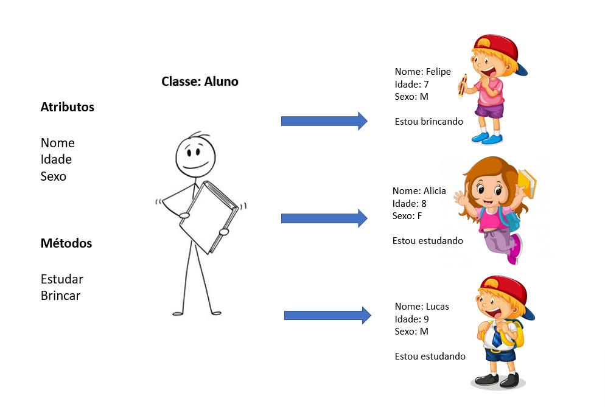

# Objetos

Um **objeto,** é um elemento computacional, que representa no domínio da solução, alguma entidade (abstrata ou concreta) do domínio, de interesse do problema sob análise. Objetos similares são agrupados em **classes**.

No paradigma de orientação a objetos, tudo pode ser potencialmente representado como um objeto. Sob o ponto de vista da programação, um objeto não é muito diferente de uma variável no paradigma de programação convencional.&#x20;

Quando se cria um objeto, esse objeto adquire um espaço em memória, para armazenar seu estado (os valores de seu conjunto de **atributos**, definidos pela classe) e um conjunto de operações que podem ser aplicadas ao objeto (o conjunto de **métodos** definidos pela classe).

Um **programa orientado a objetos** é composto por um conjunto de objetos, que interagem através de "trocas de mensagens". Na prática, essa troca de mensagem traduz-se na invocação de métodos, entre objetos.



Para representar os objetos, conforme imagem acima, iremos criar a classe Aluno e a classe Escola para demonstrar o conceito de criação de objetos, também conhecido como instância de objetos.

```java
public class Aluno {
	String nome;
	int idade;
	String sexo;
	
	void estudar() {
		//implemente o método estudar aqui
	}
	void brincar() {
		//implemente o método brincar aqqui
	}
}
```

* Temos a classe de nome Aluno;
* Todo atributo precisa determinar um tipo;
* Um atributo pode ser do tipo de outra classe, ver [String](../recursos/a-poderosa-string.md);

```java
public class Escola {
	public static void main(String[] args) {
	
		Aluno felipe = new Aluno();
		felipe.nome = "Felipe";
		felipe.idade=7;
		felipe.sexo="M";
		
		Aluno alicia = new Aluno();
		alicia.nome = "Alicia";
		alicia.idade=8;
		alicia.sexo="F";
		
		Aluno lucas = new Aluno();
		lucas.nome = "Lucas";
		lucas.idade=9;
		lucas.sexo="M";
	}
}

```

* A classe Escola representa o nosso sistema, contendo o método principal;
* Todo novo objeto, precisa ser criado com o padrão: Objeto nomeVariavel = **new** Objeto();
* Os atributos de cada objeto, recebem os seus respectivos valores.


Existe uma convenção para a forma de escrita de nossas classes, atributos, métodos, variáveis e constantes. Consulte [Java Beans](java-beans.md).


#### Referências


