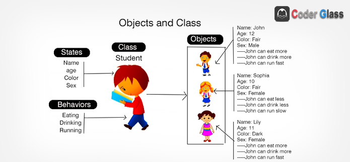

# Orientação a objetos

## Classes e objetos

Para compreendermos exatamente do que se trata a orientação a objetos, vamos entender quais são os requerimentos de uma linguagem para ser considerada nesse paradigma. Para isso, a linguagem precisa atender sobre o conceito de classes e os quatro pilares da orientação a objetos.

Primeiramente, devemos compreender que o conceito orientado a objetos, recomenda que toda estrutura de nosso código baseada a objeto seja um **Identificador**, **Características** e **Comportamentos**.

* **Classe** _(class)_: A estrutura e ou representação que direciona a criação dos objetos de mesmo tipo;
* **Características** _(states)_**:** Também conhecido como **atributos** ou **propriedades**, é toda informação que representa o estado do objeto;
* **Comportamentos** _(behavior)_**:** Também conhecido como **ações** ou **métodos**, é toda parte comportamental que um objeto dispõe;
* **Instanciar** _(new)_**:** É o ato de criar um objeto, a partir de estrutura definida em uma classe. &#x20;

## 4 Pilares do POO

A programação orientada a objetos é bem requisitada no contexto das aplicações mais atuais no mercado, devido a possibilidade de reutilização do código e a capacidade de representação do sistema ser muito mais próximo do mundo real.

Abaixo, segue uma definição conceitual dos quatro pilares da programação orientada a objetos:

*   **Encapsulamento:** Nem tudo precisa estar visível, grande parte do nosso algoritmo pode ser distribuído em métodos, com finalidades específicas que complementa uma ação, em nossa aplicação.

    Exemplo: Ligar um veículo exige muitas etapas para a engenharia, mas o condutor só visualiza  a ignição, dar a partida e a _“magia”_ acontece.
*   **Herança:** Características e comportamentos comuns, podem ser elevados e compartilhados através de uma hierarquia de objetos.

    Exemplo: Um Carro e uma Motocicleta possuem propriedades como placa, chassi, ano de fabricação e métodos como acelerar, frear. Logo, para não ser um processo de codificação redundante, podemos desfrutar da herança criando uma classe **Veiculo** para que seja herdada por Carro e Motocicleta.
*   **Abstração:** É a indisponibilidade para determinar a lógica de um ou vários comportamentos em um objeto.

    Exemplo: **Veículo** determina duas ações como acelerar e frear, logo, estes comportamentos deverão ser _abstratos_ pois existem mais de uma maneira de se realizar a mesma operação.   ver _Polimorfismo_.
*   **Polimorfismo:** São as inúmeras maneiras de se realizar uma mesma ação.

    Exemplo: Veículo determina duas ações como acelerar e frear, primeiramente precisamos identificar se estaremos nos referindo a **Carro** ou **Motocicleta** para determinar a lógica de aceleração e frenagem dos respectivos veículos.  &#x20;

**Referências:**

