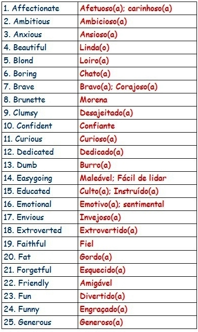
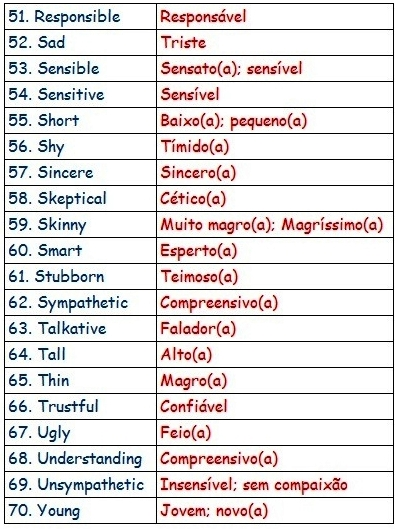

# 🇬🇧 Adjectives

Os **adjetivos em inglês,** são usados para modificar os substantivos ou pronomes, por meio de característica ou qualidade atribuída às pessoas, animais ou objetos. **São** formados a partir da junção de demais classes de palavras, podendo haver prefixo ou sufixo.

**(in)** In the list below, we will see some of the main adjectives used, in English grammar.&#x20;

<mark style="color:red;">**(br)**</mark> Na lista abaixo, veremos alguns dos principais adjetivos usados, ​​na gramática inglesa.

## List of adjectives

Lista de adjetivos

 .jpg>) 

Exemplos :&#x20;

* _My grandpa is a_ lovely old _man_. - Meu avô é um idoso adorável.
* _He lives in a_ fantastic big _house_. - Ele mora em uma casa fantástica e grande.
* _She has a brand_ new black _car._ - Ela tem um carro preto, novinho em folha.
* _They prefer the_ **old plastic** _bag._ - Eles preferem a antiga sacola de plástico.
* _It is a very cute dog. -_ Ele é um cachorro muito fofo.
* _My brother is well organized._ - Meu irmão é bem organizado.
