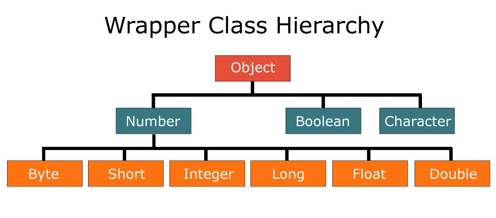

# Wrappers

Os **Wrappers** são conhecidos na linguagem Java, como classes especiais, que possuem métodos capazes de fazer conversões em variáveis primitivas e também de encapsular tipos primitivos, para serem trabalhados como objetos, ou seja, é feito um embrulho de streams que são fluxos de dados através de canais.



Sabemos que o Java, contém palavras reservadas que representam valores, em sua maioria números, além do tipo boolean e char, mas que continuam na linguagem por questões de compatibilidade de versões e performance, mas é comum optar pelo uso de tipos wrappers em novas implementações.


Uma das necessidades em se utilizar as classes wrappers, é a adesão do uso de objetos em nosso código e principalmente a conversão de tipo texto (String), para um tipo correspondente.

Cenário 1: Imagina que você precisa ler um arquivo, contendo textos que representam dados de uma compra, conforme conteúdo abaixo e precisa converter para os tipos correspondentes?


Se precisar consulte o tema: [A poderosa String](a-poderosa-string.md).


```
item;descricao;quant;vlunit;vltotal
001;NOTEBOOK;03;4000;12000
```

```java
//arquivo Wrappers.java
public static void main(String[] args) {
    //uso do delimitador ;
    String padraoCsv = "001;NOTEBOOK;03;4000;12000";
    String informacoes [] = padraoCsv.split(";");
    
    Integer itemPedido=new Integer(informacoes[0]);//via construtor
    
    String nomeProduto = informacoes[1];
    Integer quantidade = Integer.valueOf(informacoes[2]);//usando o método value
    Double valorUnitario = Double.valueOf(informacoes[3]);//usando o método value
    
    Double valorTotal = Double.parseDouble(informacoes[4]);//usando o parseXX
    
    System.out.println("O nome do produto é: " + nomeProduto);
    System.out.println("O valor do produto é: " + valorUnitario);
    
    System.out.println("O valor total do pedido é: " + valorTotal);

}
```

**Exercício**

1. Explique a diferença entre usar os métodos parseXX() ou valueOf();
2. Crie uma variável String, de nome dadosPessoais contendo os dados: PRIMEIRO NOME;ALTURA;IDADE;SEXO;ESTRANGEIRO;
3. Converta para os tipos correspondentes e imprima os dados acima, de forma individual.        _Ex.: "Meu primero nome é GLEYSON" e ..._&#x20;

#### Referências






