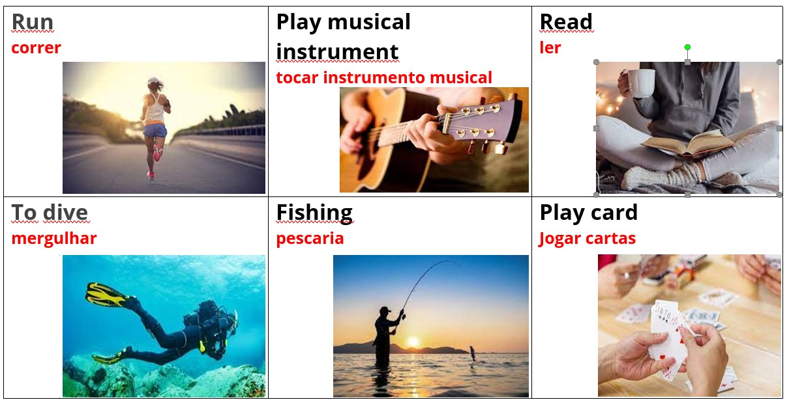
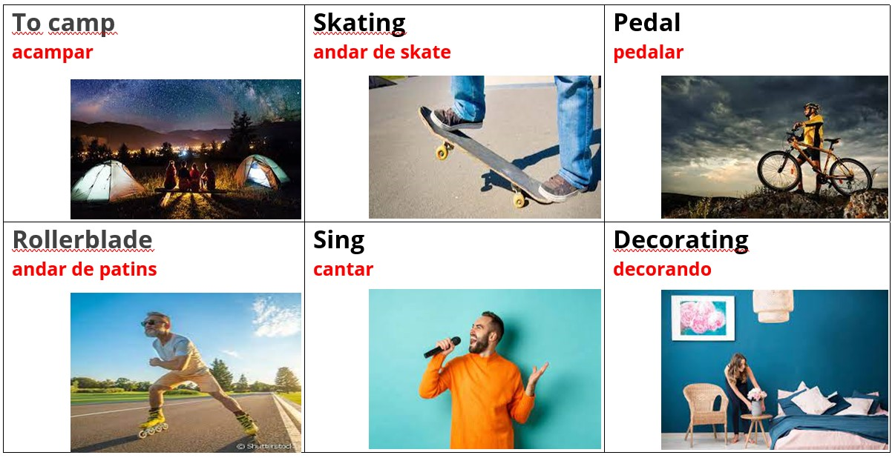
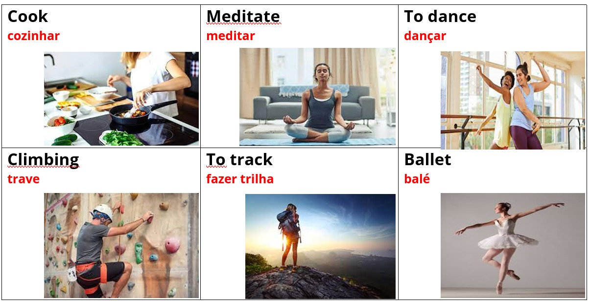
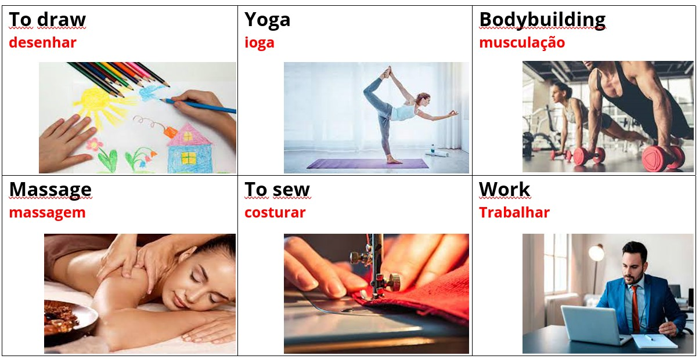

# 🏃‍♂️ Activities

<table><thead><tr><th width="161">English</th><th width="198">Português</th><th width="166">English</th><th>Português</th></tr></thead><tbody><tr><td>Run</td><td>Correr</td><td>Cook</td><td>Cozinhar</td></tr><tr><td>Play musical instrument</td><td>Tocar instrumento musical</td><td>Meditate</td><td>Meditar</td></tr><tr><td>Read</td><td>Ler</td><td>To dance</td><td>Dançar</td></tr><tr><td>To dive</td><td>Mergulhar</td><td>Climbing</td><td>Escalada</td></tr><tr><td>Fishing</td><td>Pescaria</td><td>To track</td><td>Fazer trilha</td></tr><tr><td>Play cards</td><td>Jogar cartas</td><td>Ballet</td><td>Balé</td></tr><tr><td>To camp</td><td>Acampar</td><td>To draw</td><td>Desenhar</td></tr><tr><td>Skating</td><td>Andar de skate</td><td>Yoga</td><td>Ioga</td></tr><tr><td>Pedal</td><td>Pedalar</td><td>Bodybuilding</td><td>Musculação</td></tr><tr><td>Rollerblade</td><td>Andar de patins</td><td>Massage</td><td>Massagem</td></tr><tr><td>Sing</td><td>Cantar</td><td>To sew</td><td>Costurar</td></tr><tr><td>Decorating</td><td>Decorando</td><td>Work</td><td>Trabalhar</td></tr></tbody></table>

## Images

Imagens de algumas atividades

#### Referências






