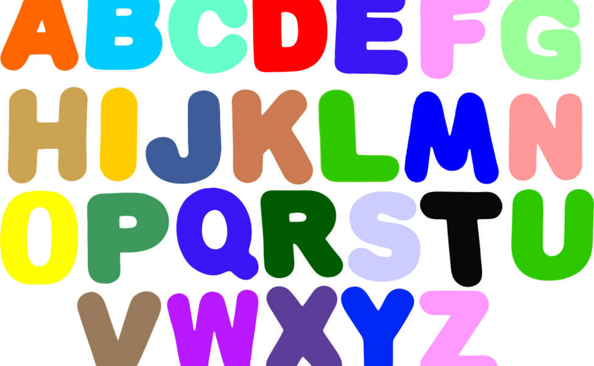

# 🅰️ Alphabet

<table><thead><tr><th width="150">Letra</th><th width="150">Pronúncia</th><th width="150">Inglês</th><th>Português</th></tr></thead><tbody><tr><td>A</td><td>êi</td><td>apple</td><td>maçã</td></tr><tr><td>B</td><td>bí</td><td>boot</td><td>bota</td></tr><tr><td>C</td><td>cí</td><td>cap</td><td>boné</td></tr><tr><td>D</td><td>dí</td><td>day</td><td>dia</td></tr><tr><td>E</td><td>í</td><td>elephant</td><td>elefante</td></tr><tr><td>F</td><td>éf</td><td>foot</td><td>pé</td></tr><tr><td>G</td><td>dgí</td><td>girl</td><td>garota</td></tr><tr><td>H</td><td>êitch</td><td>hat</td><td>chapéu</td></tr><tr><td>I</td><td>ái</td><td>ice</td><td>gelo</td></tr><tr><td>J</td><td>djêi</td><td>juice</td><td>suco</td></tr><tr><td>K</td><td>kêi</td><td>kitten</td><td>filhote de gato</td></tr><tr><td>L</td><td>él</td><td>lion</td><td>leão</td></tr><tr><td>M</td><td>êm</td><td>monster</td><td>monstro</td></tr><tr><td>N</td><td>ên</td><td>night</td><td>noite</td></tr><tr><td>O</td><td>ôu</td><td>ostrich</td><td>avestruz</td></tr><tr><td>P</td><td>pí</td><td>policeman</td><td>policial</td></tr><tr><td>Q</td><td>kíu</td><td>question</td><td>pergunta</td></tr><tr><td>R</td><td>ár</td><td>robot</td><td>robô</td></tr><tr><td>S</td><td>és</td><td>Santa Claus</td><td>Papai Noel</td></tr><tr><td>T</td><td>tí</td><td>truck</td><td>caminhão</td></tr><tr><td>U</td><td>iúl</td><td>umbrella</td><td>guarda-chuva</td></tr><tr><td>V</td><td>ví</td><td>vacation</td><td>férias</td></tr><tr><td>W</td><td>dâbliu</td><td>whale</td><td>baleia</td></tr><tr><td>X</td><td>éks</td><td>x-ray</td><td>Raio X</td></tr><tr><td>Y</td><td>uái</td><td>yo-you</td><td>iôiô</td></tr><tr><td>Z</td><td>zi</td><td>zebra</td><td>zebra</td></tr></tbody></table>

#### Referências


