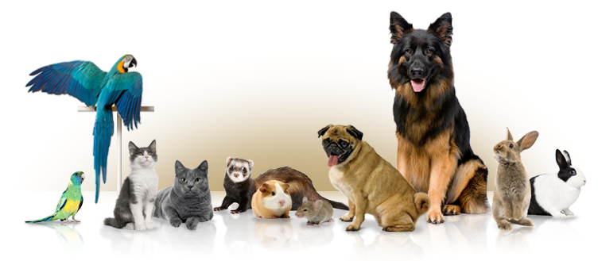
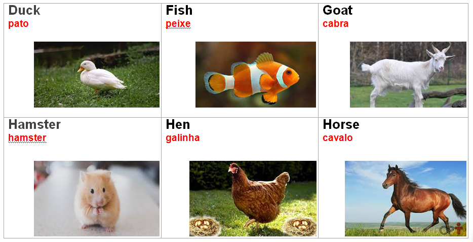
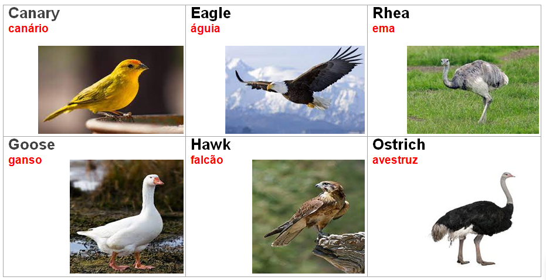
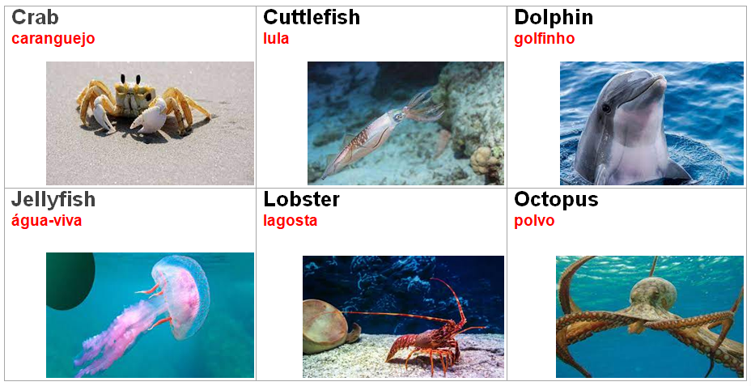
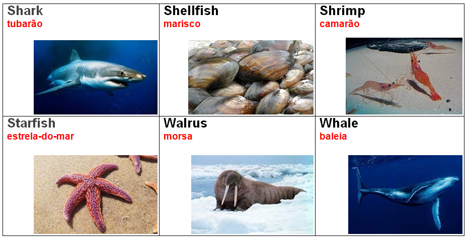

# 🐶 Animals

## List of Animals

**(en)** Below we have the list of wild, domestic, birds and marine animals.&#x20;

<mark style="color:red;">**(br)**</mark> _Abaixo temos a lista de animais silvestres, domésticos, aves e marinhos._

## Wild Animals

Lista de alguns Animais Silvestres:

<table><thead><tr><th width="153">English</th><th width="166">Português</th><th width="180.06675938803895">English</th><th>Português</th></tr></thead><tbody><tr><td>Alligator</td><td>Jacaré</td><td>Koala</td><td>Coala</td></tr><tr><td>Anteater</td><td>Tamanduá</td><td>Macaw</td><td>Arara</td></tr><tr><td>Bird</td><td>Pássaro</td><td>Monkey</td><td>Macaco</td></tr><tr><td>Buffalo</td><td>Búfalo</td><td>Owl</td><td>Coruja</td></tr><tr><td>Bull</td><td>Touro</td><td>Pelican</td><td>Pelicano</td></tr><tr><td>Frog</td><td>Sapo</td><td>Rhinoceros</td><td>Rinoceronte</td></tr><tr><td>Giraffe</td><td>Girafa</td><td>Snake</td><td>Cobra</td></tr><tr><td>Gorilla</td><td>Gorila</td><td>Tortoise</td><td>Jabuti/Cágado</td></tr><tr><td>Jaguar</td><td>Onça</td><td>Wolf</td><td>Lobo</td></tr><tr><td>Kangaroo</td><td>Canguru</td><td>Zebra</td><td>Zebra</td></tr></tbody></table>

## Domestic Animals

Lista de alguns Animais Domésticos:

<table><thead><tr><th width="150">English</th><th width="150">Português</th><th>English</th><th>Português</th></tr></thead><tbody><tr><td>Bee</td><td>Abelha</td><td>Hamster</td><td>Hamster</td></tr><tr><td>Bird</td><td>Pássaro</td><td>Hen</td><td>Galinha</td></tr><tr><td>Bunny</td><td>Coelho</td><td>Horse</td><td>Cavalo</td></tr><tr><td>Cat</td><td>Gato</td><td>Lizard</td><td>Lagarto</td></tr><tr><td>Cattle</td><td>Gado</td><td>Mouse</td><td>Rato</td></tr><tr><td>Cow</td><td>Vaca</td><td>Parrot</td><td>Papagaio</td></tr><tr><td>Dog</td><td>Cão</td><td>Peacock</td><td>Pavão</td></tr><tr><td>Duck</td><td>Pato</td><td>Pig</td><td>Porco</td></tr><tr><td>Fish</td><td>Peixe</td><td>Sheep</td><td>Ovelha </td></tr><tr><td>Goat</td><td>Cabra</td><td>Turtle</td><td>Tartaruga</td></tr></tbody></table>

## Birds

Lista de algumas Aves:

<table><thead><tr><th>English</th><th width="150">Português</th><th width="166">English</th><th>Português</th></tr></thead><tbody><tr><td>Canary</td><td>Canário</td><td>Ostrich</td><td>Avestruz</td></tr><tr><td>Duck</td><td>Pato</td><td>Owl</td><td>Coruja</td></tr><tr><td>Eagle</td><td>Águia</td><td>Parrot</td><td>Papagaio</td></tr><tr><td>Rhea</td><td>Ema</td><td>Rooster</td><td>Galo</td></tr><tr><td>Goose</td><td>Ganso</td><td>Sparrow</td><td>Pardal</td></tr><tr><td>Hawk</td><td>Falcão</td><td>Swan</td><td>Cisne</td></tr><tr><td>Hen</td><td>Galinha</td><td>Toucan</td><td>Tucano</td></tr><tr><td>Macaw</td><td>Arara</td><td>Woodpecker</td><td>Pica pau</td></tr></tbody></table>

## Marine Animal

Lista de alguns Animais Marinhos:

<table><thead><tr><th width="193">English</th><th width="199">Português</th><th width="154">English</th><th>Português</th></tr></thead><tbody><tr><td>Crab</td><td>Caranguejo</td><td>Seahorse</td><td>Cavalo-marinho</td></tr><tr><td>Cuttlefish</td><td>Lula</td><td>Seal</td><td>Foca</td></tr><tr><td>Dolphin</td><td>Golfinho</td><td>Shark</td><td>Tubarão</td></tr><tr><td>Fish</td><td>Peixe</td><td>Shellfish</td><td>Marisco</td></tr><tr><td>Jellyfish</td><td>Água-viva</td><td>Shrimo</td><td>Camarão</td></tr><tr><td>Lobster</td><td>Lagosta</td><td>Starfish</td><td>Estrela-do-mar</td></tr><tr><td>Octopus</td><td>Polvo</td><td>Walrus</td><td>Morsa</td></tr><tr><td>Oyster</td><td>Ostra</td><td>Whale</td><td>Baleia</td></tr></tbody></table>

## Imagens

Imagem de alguns animais:

.png>)

.png>)

.png>)

.png>)

**Referências**


