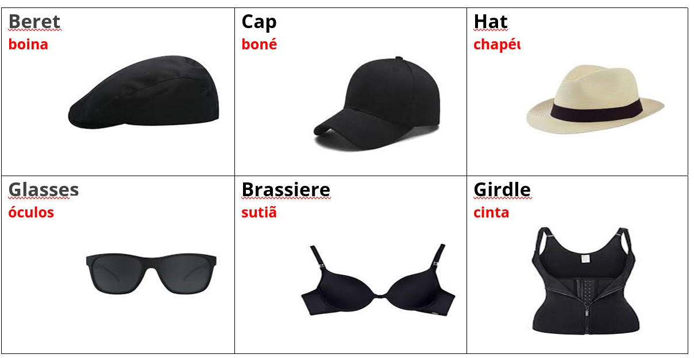
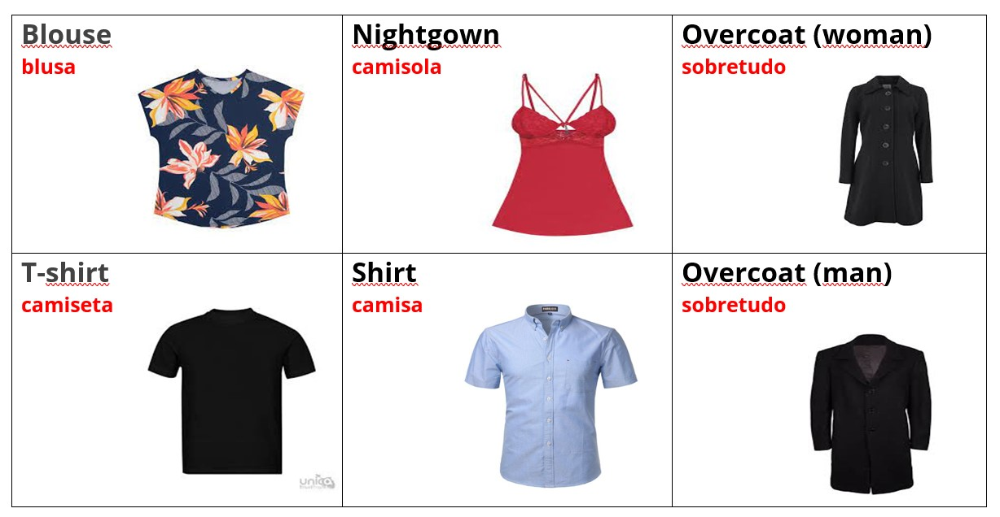
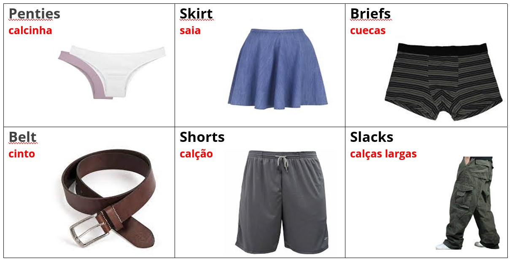
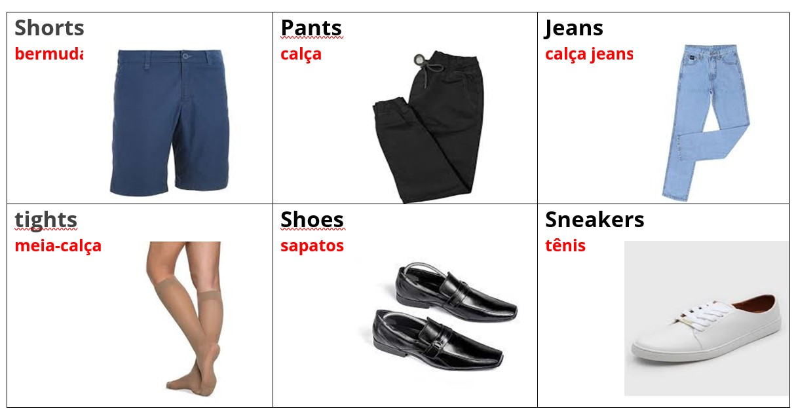
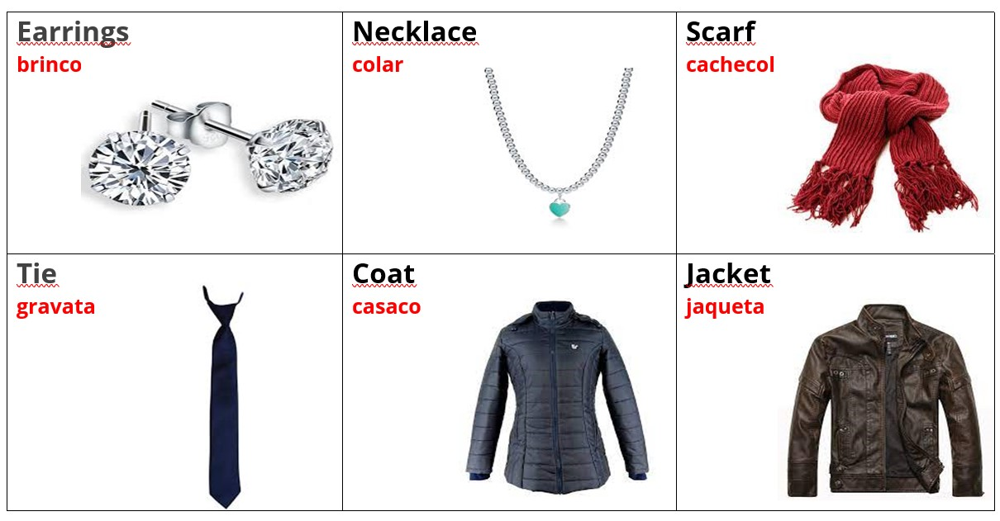
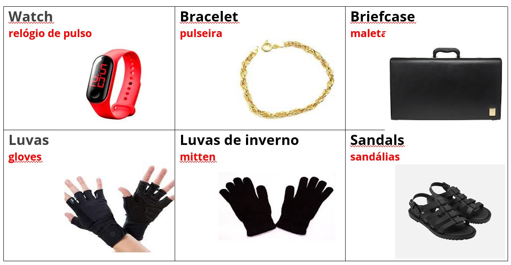
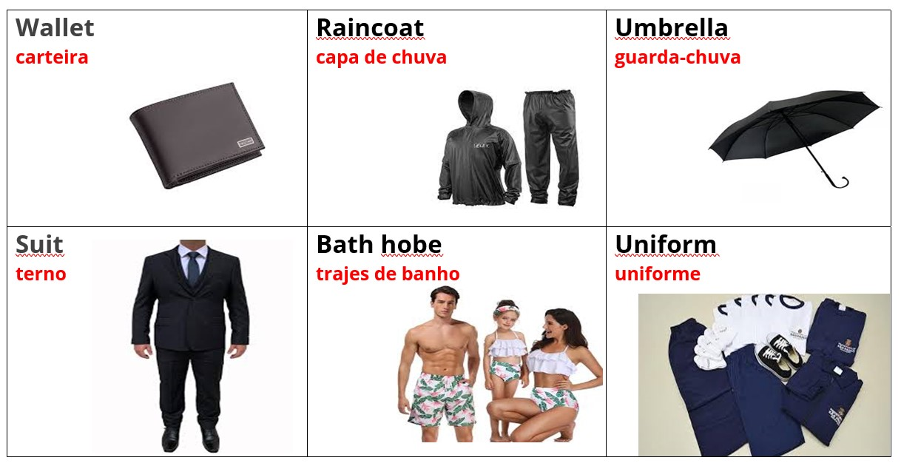

# 👕 Clothes

.jpg>)

## Clothes list

**(en)** Below, is a list of women's and men's clothing, accessories and general clothing.&#x20;

<mark style="color:red;">**(br)**</mark> _Abaixo, está uma lista de roupas femininas e masculinas, acessórios e roupas em geral._

## Women's clothes

Lista de alguma roupas femininas:

<table><thead><tr><th width="150">English</th><th width="163">Português</th><th width="150">English</th><th>Português</th></tr></thead><tbody><tr><td>Blouse</td><td>Blusa</td><td>Necklace</td><td>Colar</td></tr><tr><td>Bracelet</td><td>Pulseira</td><td>Nightgown</td><td>Camisola</td></tr><tr><td>Brassiere</td><td>Sutiã</td><td>Overcoat</td><td>Sobretudo</td></tr><tr><td>Dress</td><td>Vestido</td><td>Panties</td><td>Calcinha</td></tr><tr><td>Earrings</td><td>Brincos</td><td>Skirt</td><td>Saia</td></tr><tr><td>Girdle</td><td>Cinta</td><td>Tights</td><td>Meia-calça</td></tr></tbody></table>

## Men's clothes

Lista de algumas roupas masculinas:

<table><thead><tr><th width="150">English</th><th width="157">Português</th><th width="150">English</th><th width="160.70167427701674">Português</th></tr></thead><tbody><tr><td>Belt</td><td>Cinto</td><td>Shoes</td><td>Sapatos</td></tr><tr><td>Briefcase</td><td>Maleta</td><td>Shorts</td><td>Calção</td></tr><tr><td>Briefs</td><td>Cuecas</td><td>Slacks</td><td>Calças largas</td></tr><tr><td>Cap</td><td>Boné</td><td>Tie</td><td>Gravata</td></tr><tr><td>Overcoat</td><td>Sobretudo</td><td>T-shirt</td><td>Camiseta</td></tr></tbody></table>

## Accessories

Lista de alguns acessórios:

<table><thead><tr><th width="150">English</th><th width="157.74581430745815">Português</th><th width="150">English</th><th width="172.44348461953211">Português</th></tr></thead><tbody><tr><td>Beret</td><td>Boina</td><td>Necklace</td><td>Colar</td></tr><tr><td>Bracelet</td><td>Pulseira</td><td>Raincoat</td><td>Capa de chuva</td></tr><tr><td>Earrings</td><td>Brincos</td><td>Sandals</td><td>Sandálias</td></tr><tr><td>Glasses</td><td>Óculos</td><td>Scarf</td><td>Cachecol</td></tr><tr><td>Gloves</td><td>Luvas</td><td>Umbrella</td><td>Guarda-chuva</td></tr><tr><td>Hat</td><td>Chapéu</td><td>Wallet</td><td>Carteira</td></tr><tr><td>MItten</td><td>Luvas de inverno</td><td>Watch</td><td>Relógio de pulso</td></tr></tbody></table>

## Clothes in general

Roupas em geral:

<table><thead><tr><th width="161.09473684210528">English</th><th width="166.19637883008357">Português</th><th width="150">English</th><th width="165.87990900563784">Português</th></tr></thead><tbody><tr><td>Barhing Suits</td><td>Trajes de banho</td><td>Shorts</td><td>Shorts</td></tr><tr><td>Coat</td><td>Casaco</td><td>Sneakers</td><td>Tênis</td></tr><tr><td>Jacket</td><td>Jaqueta</td><td>Socks</td><td>Meias</td></tr><tr><td>Jeans</td><td>Calça Jeans</td><td>Suit</td><td>Terno</td></tr><tr><td>Pants</td><td>Calça</td><td>Sweter</td><td>Suéter</td></tr><tr><td>Shirt</td><td>Camisa</td><td>Underwear</td><td>Roupas de baixo</td></tr><tr><td>Shorts</td><td>Bermuda</td><td>Uniform</td><td>Uniforme</td></tr></tbody></table>

## Images

Imagens de algumas roupas e acessórios:

**Referências**


