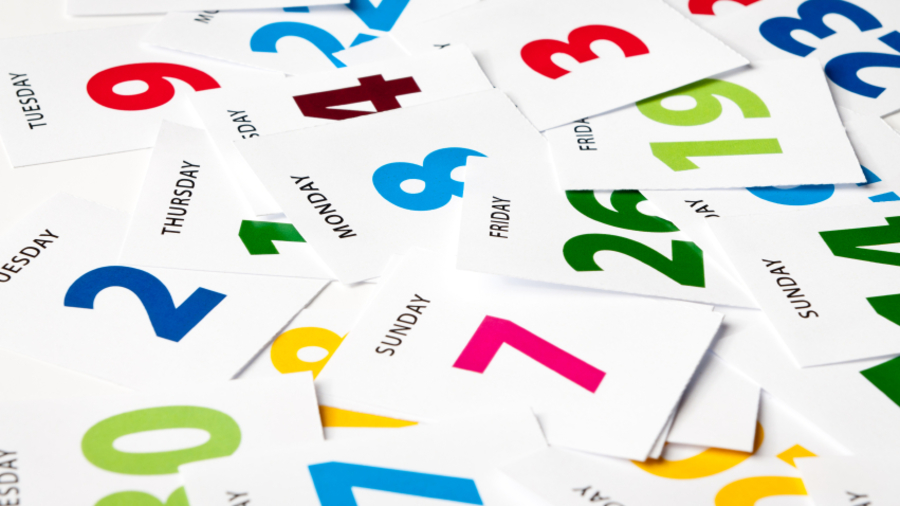

# 🗓️ Days of Year

## List of days of year

**(en)** On this page, we will cover everything in the year. Like: months, days of the week, hours, commemorative dates, seasons, among others.

&#x20;<mark style="color:red;">**(br)**</mark> _Nessa página, vamos abordar tudo no ano. Como: meses, dias da semana, horas, datas comemorativas, estações do ano entre outros._

## Months

Lista dos meses:

<table><thead><tr><th width="150">English</th><th width="172">Português</th><th width="207.202216066482">English</th><th>Português</th></tr></thead><tbody><tr><td>January</td><td>Janeiro</td><td>July</td><td>Julho</td></tr><tr><td>February</td><td>Fevereiro</td><td>August</td><td>Agosto</td></tr><tr><td>March</td><td>Março</td><td>September</td><td>Setembro</td></tr><tr><td>April</td><td>Abril</td><td>October</td><td>Outubro</td></tr><tr><td>May</td><td>Maio</td><td>November</td><td>Novembro</td></tr><tr><td>June</td><td>Junho </td><td>December</td><td>Dezembro</td></tr></tbody></table>

## Days of the week

Lista dos dias da semana:

| English   | Português     |
| --------- | ------------- |
| Sunday    | Domingo       |
| Monday    | Segunda-feira |
| Tuesday   | Terça-feira   |
| Wednesday | Quarta-feira  |
| Thursday  | Quinta-feira  |
| Friday    | Sexta-feira   |
| Saturday  | Sábado        |

## Hours

Lista de horas e expressões de tempo:

<table><thead><tr><th width="182">English</th><th width="172">Português</th><th width="150">English</th><th>Português</th></tr></thead><tbody><tr><td>Day</td><td>Dia</td><td>Afternoon</td><td>Tarde</td></tr><tr><td>Today</td><td>Hoje</td><td>Evening</td><td>Noite (cedo)</td></tr><tr><td>Yesterday</td><td>Ontem</td><td>Night</td><td>Noite</td></tr><tr><td>The day before yesterday</td><td>Antes de ontem</td><td>Tonight</td><td>Esta noite</td></tr><tr><td>Last week</td><td>Semana passada</td><td>Midday</td><td>Meio-dia</td></tr><tr><td>Tomorrow</td><td>Amanhã</td><td>At noon</td><td>Ao meio-dia</td></tr><tr><td>The day after tomorrow</td><td>Depois de amanhã</td><td>Midnight</td><td>Meia noite</td></tr><tr><td>Morning</td><td>Manhã</td><td>At midnight</td><td>Há meia noite</td></tr></tbody></table>

## Commemorative dates

Lista de datas comemorativas:

| English        | Português          |
| -------------- | ------------------ |
| New year's day | Ano novo           |
| Easter         | Páscoa             |
| Mother's day   | Dia das mães       |
| Father's day   | Dia dos pais       |
| Labor day      | Dia do trabalhador |
| Halloween      | Dia das Bruxas     |
| Christmas      | Natal              |

## Seasons

Lista das estações do ano:

| English | Português |
| ------- | --------- |
| Summer  | Verão     |
| Winter  | Inverno   |
| Spring  | Primavera |
| Autumn  | Outono    |
