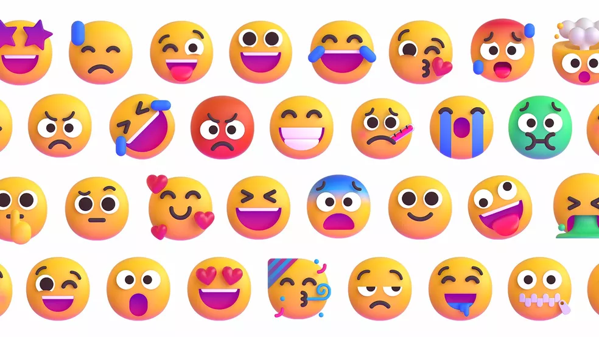

# 😊 Feelings

<table><thead><tr><th width="150">English</th><th width="157">Português</th><th width="169.59830268741158">English</th><th>Português</th></tr></thead><tbody><tr><td>Angry</td><td>Bravo</td><td>Frustrated</td><td>Frustrado</td></tr><tr><td>Anxious</td><td>Ansioso</td><td>Furious</td><td>Furioso</td></tr><tr><td>Ashamed</td><td>Constrangido</td><td>Happy</td><td>Feliz</td></tr><tr><td>Bored</td><td>Entediado</td><td>Humiliated</td><td>Humilhado</td></tr><tr><td>Calm</td><td>Calmo</td><td>In love</td><td>Apaixonado</td></tr><tr><td>Confident</td><td>Confiante</td><td>Jealous</td><td>Ciumento</td></tr><tr><td>Confused</td><td>Confuso</td><td>Nervous</td><td>Nervoso</td></tr><tr><td>Depressed</td><td>Deprimido</td><td>Sad</td><td>Triste</td></tr><tr><td>Disappointed</td><td>Decepcionado</td><td>Sleepy</td><td>Sonolento</td></tr><tr><td>Envious</td><td>Invejoso</td><td>Upset</td><td>Chateado / Aborrecido</td></tr></tbody></table>
