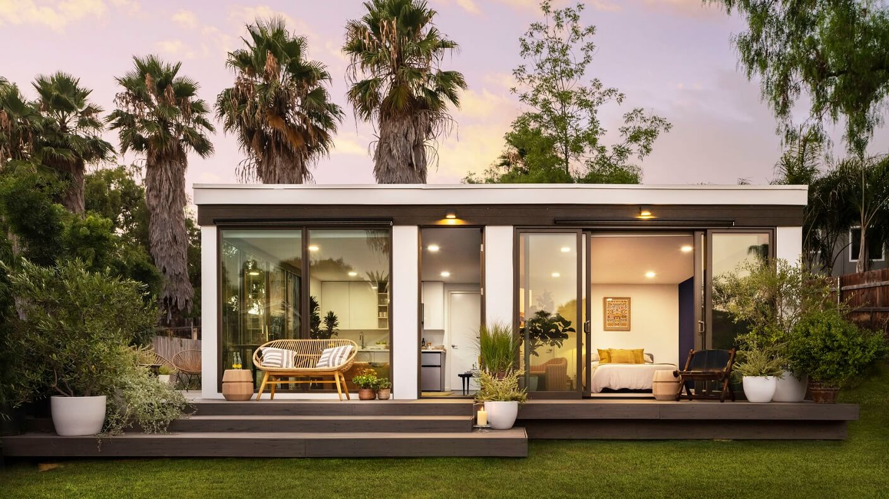

# 🏠 House

## Places in the house

**(en)** Below, you'll find everything related to houses, from their variations to their compartments and their respective objects.&#x20;

<mark style="color:red;">**(br)**</mark> _Abaixo, você encontrará tudo relacionado a casas, desde suas variações até seus compartimentos e seus respectivos objetos._

## Houses

Lista de tipos de casas (variações):

| English   | Português         |
| --------- | ----------------- |
| House     | Casa              |
| Apartment | Apartamento       |
| Building  | Prédio            |
| Cottage   | Chalé ou Cabana   |
| Mansion   | Mansão            |
| Ranch     | Rancho ou Fazenda |
| Bungalow  | Bangalô           |

## Compartments and objects of the House

**(en)** In this part of the content, the compartments and the objects that make them up will be presented.&#x20;

<mark style="color:red;">**(br)**</mark> _Nessa parte do conteúdo, serão apresentados os compartimentos e os objetos que os compõem._

## Living room

Lista dos objetos da sala de estar:

<table><thead><tr><th width="150">English</th><th width="165">Português</th><th>English</th><th>Português</th></tr></thead><tbody><tr><td>Armchair</td><td>Poltrona</td><td>Picture frame</td><td>Porta-retrato</td></tr><tr><td>Carpet</td><td>Tapete</td><td>Sofa</td><td>Sofá</td></tr><tr><td>Chair</td><td>Cadeira</td><td>Telephone</td><td>Telefone</td></tr><tr><td>Curtain</td><td>Cortina</td><td>Television</td><td>Televisão</td></tr><tr><td>Fireplace</td><td>Lareira</td><td>TV cabinet</td><td>Movél de TV</td></tr></tbody></table>

## Bedroom

Lista de objetos do quarto:

<table><thead><tr><th width="164">English</th><th width="160">Português</th><th>English</th><th>Português</th></tr></thead><tbody><tr><td>Bed</td><td>Cama</td><td>Mattress</td><td>Colchão</td></tr><tr><td>Bedside lamp</td><td>Abajur</td><td>Nightstand</td><td>Criado-mudo</td></tr><tr><td>Blanket</td><td>Cobertor</td><td>Pillow</td><td>Travesseiro</td></tr><tr><td>Closet</td><td>Guarda-roupa</td><td>Rug</td><td>Tapete de quarto</td></tr><tr><td>Dresser</td><td>
Cômoda/

aparador
</td><td>Sheet</td><td>Lençol</td></tr></tbody></table>

## Office

Lista de objetos do escritório:

| English      | Português             |
| ------------ | --------------------- |
| Computer     | Computador            |
| Desk         | Escrivaninha          |
| Notebook     | Caderno               |
| Office chair | Cadeira de escritório |
| Pen          | Caneta                |
| Pinter       | Impressora            |
| Table lamp   | Luminária             |

## Kitchen

Lista de objetos da cozinha:

<table><thead><tr><th width="200">English</th><th width="164">Português</th><th width="159">English</th><th width="200">Português</th></tr></thead><tbody><tr><td>Bowl</td><td>Tijela</td><td>Kitchen trash</td><td>Lixo de cozinha</td></tr><tr><td>Chair</td><td>Cadeira</td><td>Knife</td><td>Faca</td></tr><tr><td>Cooking pot</td><td>Panela</td><td>Microwave</td><td>Micro-ondas</td></tr><tr><td>Cup</td><td>Xícara</td><td>Mug</td><td>Caneca</td></tr><tr><td>Cutlery</td><td>Talheres</td><td>Plate</td><td>Prato</td></tr><tr><td>Dishwasher</td><td>Máquinha de lavar louça</td><td>Refrigerator</td><td>Refrigerador</td></tr><tr><td>Fork</td><td>Garfo</td><td>Spoon</td><td>Colher</td></tr><tr><td>Freezer</td><td>Geladeira</td><td>Stove</td><td>Fogão</td></tr><tr><td>Glass</td><td>Copo</td><td>Table</td><td>Mesa</td></tr></tbody></table>

## Bathroom

Lista de objetos do banheiro:

<table><thead><tr><th width="176">English</th><th width="175">Português</th><th width="150">English</th><th>Português</th></tr></thead><tbody><tr><td>Bath mat</td><td>Tapete de banho</td><td>Soap</td><td>Sabonete</td></tr><tr><td>Bathtub</td><td>Banheira</td><td>Soap dish</td><td>Saboneteira</td></tr><tr><td>Mirror</td><td>Mirror</td><td>Toilet</td><td>Vaso Sanitário</td></tr><tr><td>Shower</td><td>Chuveiro</td><td>Toothbrush</td><td>Escova de dente</td></tr><tr><td>Shower curtain</td><td>Cortina de chuveiro</td><td>Toothpaste</td><td>Pasta de dente</td></tr><tr><td>Sink</td><td>Pia</td><td>Towel</td><td>Toalha</td></tr></tbody></table>

## Laundry

Lista de objetos da lavanderia:

| English         | Português              |
| --------------- | ---------------------- |
| Clothesline     | Varal                  |
| Clothespin      | Prendedor de roupa     |
| Iron            | Ferro de passar roupa  |
| Ironing board   | Tábua de passar roupa  |
| Washing machine | Máquina de lavar louça |
