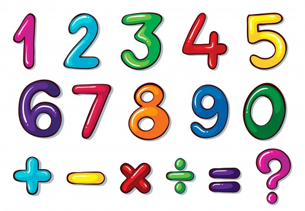

# 1️ Numbers

## Cardinal numbers - Números cardinais

| Número        | English                | Português      |
| ------------- | ---------------------- | -------------- |
| 0             | zero                   | zero           |
| 1             | one                    | um             |
| 2             | two                    | dois           |
| 3             | three                  | três           |
| 4             | four                   | quatro         |
| 5             | five                   | cinco          |
| 6             | six                    | seis           |
| 7             | seven                  | sete           |
| 8             | eight                  | oito           |
| 9             | nine                   | nove           |
| 10            | ten                    | dez            |
| 11            | eleven                 | onze           |
| 12            | twelve                 | doze           |
| 13            | thirteen               | treze          |
| 14            | fourteen               | catorze        |
| 15            | fifteen                | quinze         |
| 16            | sixteen                | dezesseis      |
| 17            | seventeen              | dezessete      |
| 18            | eighteen               | dezoito        |
| 19            | nineteen               | dezenove       |
| 20            | twenty                 | vinte          |
| 21            | twenty-one             | vinte e um     |
| 22            | twenty-two             | vinte e dois   |
| 23            | twenty-three           | vinte e três   |
| 24            | twenty-four            | vinte e quatro |
| 25            | twenty-five            | vinte e cinco  |
| 26            | twenty-six             | vinte e seis   |
| 27            | twenty-seven           | vinte e sete   |
| 28            | twenty-eight           | vinte e oito   |
| 29            | twenty-nine            | vinte e nove   |
| 30            | thirty                 | trinta         |
| 40            | forty                  | quarenta       |
| 50            | fifty                  | cinquenta      |
| 60            | sixty                  | sessenta       |
| 70            | seventy                | setenta        |
| 80            | eighty                 | oitenta        |
| 90            | ninety                 | noventa        |
| 100           | one hundred/ a hundred | cem            |
| 200           | two hundred            | duzentos       |
| 300           | three hundred          | trezentos      |
| 400           | four hundred           | quatrocentos   |
| 500           | five hundred           | quinhentos     |
| 600           | six hundred            | seiscentos     |
| 700           | seven hundred          | setecentos     |
| 800           | eight hundred          | oitocentos     |
| 900           | nine hundred           | novecentos     |
| 1.000         | one thousand           | mil            |
| 10.000        | ten thousand           | dez mil        |
| 100.000       | one hundred thousand   | cem mil        |
| 1.000.000     | one million            | um milhão      |
| 1.000.000.000 | one billion            | um bilhão      |

## Ordinal numbers - Números ordinais

| Número        | English             | Português         |
| ------------- | ------------------- | ----------------- |
| 1st           | first               | primeiro          |
| 2nd           | second              | segundo           |
| 3rd           | third               | terceiro          |
| 4th           | fourth              | quarto            |
| 5th           | fifth               | quinto            |
| 6th           | sixth               | sexto             |
| 7th           | seventh             | sétimo            |
| 8th           | eighth              | oitavo            |
| 9th           | ninth               | nono              |
| 10th          | tenth               | décimo            |
| 11th          | eleventh            | décimo primeiro   |
| 12th          | twelfth             | décimo segundo    |
| 13th          | thirteenth          | décimo terceiro   |
| 14th          | fourteenth          | décimo quarto     |
| 15th          | fifteenth           | décimo quinto     |
| 16th          | sixteenth           | décimo sexto      |
| 17th          | seventeenth         | décimo sétimo     |
| 18th          | eighteenth          | décimo oitavo     |
| 19th          | nineteenth          | décimo nono       |
| 20th          | twentieth           | vigésimo          |
| 21st          | twenty-first        | vigésimo primeiro |
| 22nd          | twenty-second       | vigésimo segundo  |
| 23rd          | twenty-third        | vigésimo terceiro |
| 24th          | twenty-fourth       | vigésimo quarto   |
| 25th          | twenty-fifth        | vigésimo quinto   |
| 26th          | twenty-sixth        | vigésimo sexto    |
| 27th          | twenty-seventh      | vigésimo sétimo   |
| 28th          | twenty-eight        | vigésimo oitavo   |
| 29th          | twenty-ninth        | vigésimo nono     |
| 30th          | thirtieth           | trigésimo         |
| 40th          | fourtieth           | quadragésimo      |
| 50th          | fiftieth            | quinquagésimo     |
| 60th          | sixtieth            | sexagésimo        |
| 70th          | seventieth          | septuagésimo      |
| 80th          | eightieth           | octogésimo        |
| 90th          | ninetieth           | nonagésimo        |
| 100           | one hundredth       | centésimo         |
| 110           | one hundredth tenth | centésimo décimo  |
| 1.000         | one thousandth      | milésimo          |
| 1.000.000     | one millionth       | milionésimo       |
| 1.000.000.000 | one billionth       | bilionésimo       |

**Referências**




