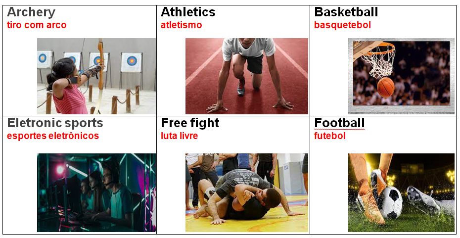
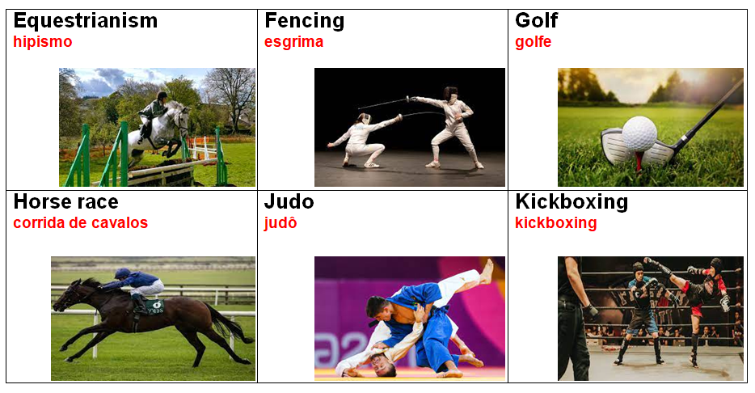

# ⚽ Sports

## Olympic Games - Jogos Olimpícos

**(en)** The Summer Olympics, also known as the Olympic Games, is a major international multi-sport event usually held every four years.&#x20;

<mark style="color:red;">**(br)**</mark> Os Jogos Olímpicos de Verão, também conhecidos como Jogos das Olimpíadas, são um grande evento multiesportivo internacional, normalmente realizado a cada quatro anos.

## List of Sports

**(en)** Below is a list of existing sports around the world and that are part of the olympics.&#x20;

<mark style="color:red;">**(br)**</mark> _Abaixo segue uma lista dos esportes existentes pelo mundo e fazem parte das olimpíadas._

<table><thead><tr><th width="150">English</th><th width="161">Português</th><th width="150">Eglish</th><th>Português</th></tr></thead><tbody><tr><td>Archery</td><td>Tiro com arco</td><td>Artistic Gymnastics</td><td>Ginástica artística</td></tr><tr><td>Athletics</td><td>Atletismo</td><td>Boxing</td><td>Boxe</td></tr><tr><td>Basket Ball</td><td>Basquetebol</td><td>Darts</td><td>Dardos</td></tr><tr><td>Eletronic Sports</td><td>Esportes eletrônicos</td><td>Equestrian</td><td>Equestre</td></tr><tr><td>Free Figth</td><td>Luta livre</td><td>Fencing</td><td>Esgrima</td></tr><tr><td>Football</td><td>Futebol</td><td>Golf</td><td>Golfe</td></tr><tr><td>Gynastic</td><td>Ginástica</td><td>Handball</td><td>Handebol</td></tr><tr><td>Handball</td><td>Handebol</td><td>Horse Race</td><td>Corrida de Cavalos</td></tr><tr><td>Ice Hockey</td><td>Hockey no gelo</td><td>Judo</td><td>Judô</td></tr><tr><td>Karate</td><td>Karatê</td><td>Kickboxing</td><td>Kickboxing</td></tr><tr><td>Lacross</td><td>Lacrosse</td><td>MMA</td><td>MMA</td></tr><tr><td>Polo</td><td>Pólo</td><td>Motorcycling</td><td>Motociclismo</td></tr><tr><td>Running</td><td>Corrida</td><td>Rugby</td><td>Rúgbi</td></tr><tr><td>Surf</td><td>Surf</td><td>Swimming</td><td>Natação</td></tr><tr><td>Tennis</td><td>Tênis</td><td>Volley Ball</td><td>Voleibol</td></tr><tr><td>Water polo</td><td>Pólo aquático</td><td>Football</td><td>Futebol americano</td></tr><tr><td>Yoga</td><td>Ioga</td><td>Hockey</td><td>Hóquei</td></tr></tbody></table>

## Images - imagens

## Vocabulary - Vocabulário

**(en)** Here we are going to see and learn some words that are present in the middle of sports seen above.&#x20;

<mark style="color:red;">**(br)**</mark> _Aqui vamos ver e aprender algumas palavras, que estão presentes no meio dos esportes vistos acima._

<table><thead><tr><th width="150">English</th><th width="164.79689555216962">Português</th><th width="160.7142857142857">English</th><th>Português</th></tr></thead><tbody><tr><td>Arrow</td><td>Flecha</td><td>Goal</td><td>Gol</td></tr><tr><td>Ball</td><td>Bola</td><td>Grid</td><td>Rede</td></tr><tr><td>Basket</td><td>Cesta</td><td>Motocycle</td><td>Moto</td></tr><tr><td>Bat</td><td>Taco</td><td>Players</td><td>Jogadores</td></tr><tr><td>Bow</td><td>Arco</td><td>Racket</td><td>Raquete</td></tr><tr><td>Computer</td><td>Computador</td><td>Shower cap</td><td>Touca de banho</td></tr><tr><td>Croosbar</td><td>Trave</td><td>Surfboard</td><td>Prancha de surfe</td></tr><tr><td>Diving goggles</td><td>Óculos de mergulho</td><td>Sword</td><td>Espada</td></tr><tr><td>Football boots</td><td>Chuteira</td><td>Target</td><td>Alvo</td></tr><tr><td>Gloves</td><td>Luvas</td><td>Uniform</td><td>Uniform</td></tr></tbody></table>

#### Referências






