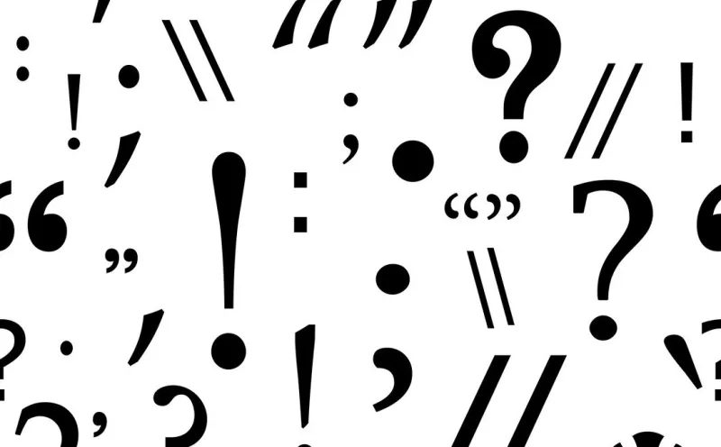

# #️ Symbols and Dots

## List of symbols

Lista de símbolos:

<table><thead><tr><th width="170">English</th><th width="174">Português</th><th>Pontos</th></tr></thead><tbody><tr><td>Period</td><td>Ponto</td><td>.</td></tr><tr><td>Comma</td><td>Vírgula</td><td>,</td></tr><tr><td>Exclamation mark</td><td>Ponto de exclamação</td><td>!</td></tr><tr><td>Question mark</td><td>Ponto de interrogação</td><td>?</td></tr><tr><td>Colon</td><td>Dois pontos</td><td>:</td></tr><tr><td>Semicolon</td><td>Ponto e vírgula</td><td>;</td></tr><tr><td>Quotation mark</td><td>Aspas</td><td>" "</td></tr><tr><td>Apostrophe</td><td>Apóstrofo</td><td>`</td></tr><tr><td>Hyphen and Dash</td><td>Hífen e Travessão</td><td>-</td></tr><tr><td>Brackets</td><td>Colchetes</td><td>[]</td></tr><tr><td>Parentheses</td><td>Parênteses</td><td>()</td></tr><tr><td>At sign</td><td>Arroba</td><td>@</td></tr><tr><td>Hash</td><td>Jogo da velha</td><td>#</td></tr><tr><td>Ampersand</td><td>E comercial</td><td>&#x26;</td></tr><tr><td>Asterisk</td><td>Asterisco</td><td>*</td></tr></tbody></table>
