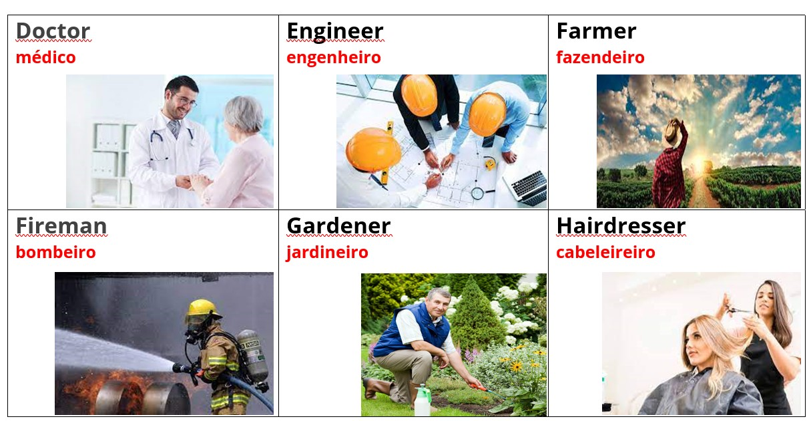

# 👨‍💼 Professions

## List of professions

**(en)** Below is a list of professions. 

<mark style="color:red;">**(br)**</mark> _Abaixo está uma lista de profissões._

<table><thead><tr><th width="150">English</th><th width="180.52734684907762">Português</th><th width="177.4188873305283">English</th><th>Português</th></tr></thead><tbody><tr><td>Actor</td><td>Ator</td><td>Gardener</td><td>Jardineiro</td></tr><tr><td>Barber</td><td>Barbeiro</td><td>Hairdresser</td><td>Cabeleireiro</td></tr><tr><td>Bricklayer</td><td>Pedreiro</td><td>Journalist</td><td>Jornalista</td></tr><tr><td>Chef</td><td>Cozinheiro</td><td>Lawyer</td><td>Advogado</td></tr><tr><td>Dancer</td><td>Dançarino</td><td>Mechanical</td><td>Mecânico</td></tr><tr><td>Dentist</td><td>Dentista</td><td>Nurse</td><td>Enfermeiro</td></tr><tr><td>Doctor</td><td>Médico</td><td>Paintor</td><td>Pintor</td></tr><tr><td>Engineer</td><td>Engenheiro</td><td>Photographer</td><td>Fotógrafo</td></tr><tr><td>Farmer</td><td>Fazendeiro</td><td>Policeman</td><td>Policial</td></tr><tr><td>Fireman</td><td>Bombeiro</td><td>Teacher</td><td>Professora</td></tr></tbody></table>

## Images

Imagens de algumas profissões:

