# 🏪 Work Places

## School - Escola

**(en)** Below, we will see some words related to school, such as characters and items.&#x20;

<mark style="color:red;">**(br)**</mark> Abaixo, veremos algumas palavras relacionadas a escola, como personagens e itens.

#### Characters - Personagens

<table><thead><tr><th width="150">English</th><th width="152">Português</th><th width="150">English</th><th>Português</th></tr></thead><tbody><tr><td>Teacher</td><td>Professor(a)</td><td>Manager</td><td>Gestor(a)</td></tr><tr><td>Principal</td><td>Diretor(a)</td><td>Coordinator</td><td>Coordenador(a)</td></tr><tr><td>Caretaker</td><td>Zelador(a)</td><td>Student</td><td>Aluno(a)</td></tr></tbody></table>

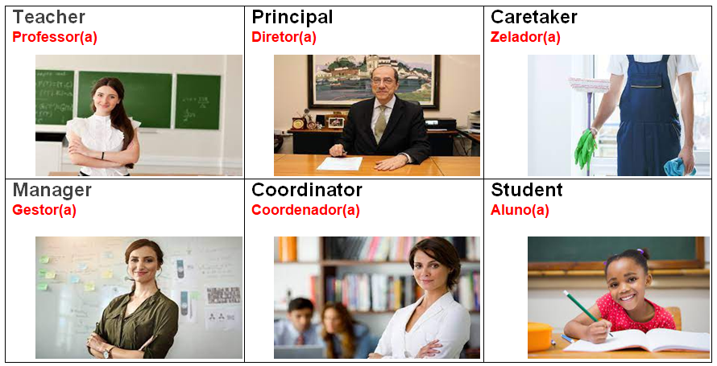

#### Items - Itens

<table><thead><tr><th width="171">English</th><th width="154">Português</th><th>English</th><th>Português</th></tr></thead><tbody><tr><td>Backboard</td><td>Lousa</td><td>Pencil case</td><td>Estojo</td></tr><tr><td>Whiteboard</td><td>Quadro branco</td><td>Glue</td><td>Cola</td></tr><tr><td>Backpack</td><td>Mochila</td><td>Stapler</td><td>Grampeador</td></tr><tr><td>Book </td><td>Livro</td><td>Paper</td><td>Papel</td></tr><tr><td>Pencil</td><td>Lápis</td><td>Pen</td><td>Caneta</td></tr><tr><td>Notebook</td><td>Caderno</td><td>Marker</td><td>Canetinha</td></tr><tr><td>Eraser</td><td>Borracha</td><td>Paint brushes</td><td>Pincéis</td></tr><tr><td>Ruler</td><td>Régua</td><td>Paint</td><td>Tinta</td></tr><tr><td>Scissors</td><td>Tesoura</td><td>Dictionary</td><td>Dicionário</td></tr><tr><td>Chair</td><td>Cadeira</td><td>Sharpener</td><td>Apontador</td></tr><tr><td>Desk </td><td>Mesa</td><td>Mechanical pencil</td><td>Lapiseira</td></tr></tbody></table>

## Bank - Banco

**(en)** Below, we will see some words related to bank, such as characters and items.&#x20;

<mark style="color:red;">**(br)**</mark> Abaixo, veremos algumas palavras relacionadas a banco, como personagens e itens.

#### Caracters - Personagem

| English   | Português          |
| --------- | ------------------ |
| Assistant | Assistente         |
| Cashier   | Atendente de caixa |
| Security  | Segurança          |
| Manager   | Gerente            |

#### Items - Itens

| English        | Potuguês            |
| -------------- | ------------------- |
| Computer       | Computador          |
| Cash machine   | Caixa eletrônico    |
| Customer files | Arquivos do cliente |
| Money          | Dinheiro            |
| Payments       | Pagamentos          |
| Deposits       | Depósitos           |

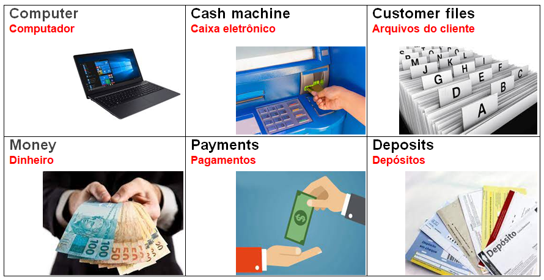

## Supermarket - Supermercado

**(en)** Below we will see some words related to supermarket, such as characters and items.&#x20;

<mark style="color:red;">**(br)**</mark> Abaixo veremos algumas palavras relacionadas a supermercado, como personagens e itens.

#### Characters - Personagens

<table><thead><tr><th width="150">English</th><th width="157">Português</th><th width="177.59830268741158">English</th><th>Português</th></tr></thead><tbody><tr><td>Clerk</td><td>Balconista</td><td>Deliveryman</td><td>Entregador</td></tr><tr><td>Stockman</td><td>Encarregado de estoque</td><td>Packer</td><td>Empacotador</td></tr><tr><td>Restocker</td><td>Repositor de mercadorias</td><td>General services</td><td>Serviços gerais</td></tr></tbody></table>

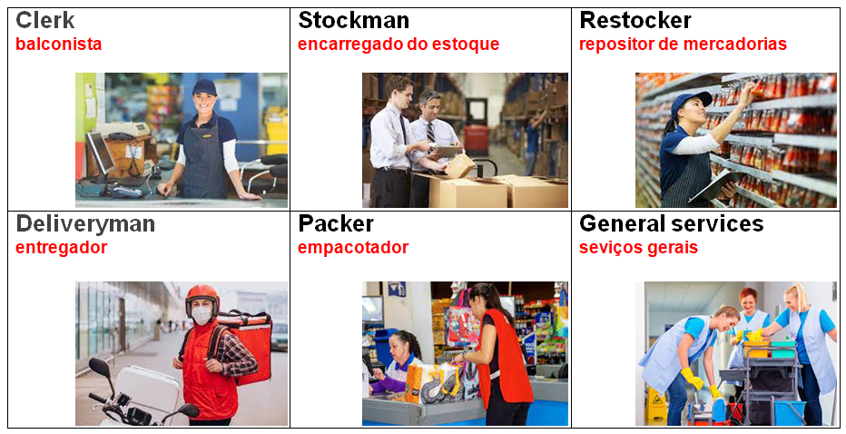

#### Items - Itens

<table><thead><tr><th width="150">English</th><th width="161">Português</th><th width="170.40787623066106">English</th><th>Português</th></tr></thead><tbody><tr><td>Aisle</td><td>Corredor</td><td>Closeout sale </td><td>Liquidação</td></tr><tr><td>Customer</td><td>Cliente</td><td>Cash</td><td>Dinheiro</td></tr><tr><td>Express lane</td><td>Fila rápida</td><td>Freezer</td><td>Congelador</td></tr><tr><td>Barcode</td><td>Código de barras</td><td>Fridge</td><td>Refrigerador</td></tr><tr><td>Bag</td><td>Sacola</td><td>Fronzen food</td><td>Comida congelada</td></tr><tr><td>Coin</td><td>Moeda</td><td>On sale</td><td>Promoção</td></tr></tbody></table>

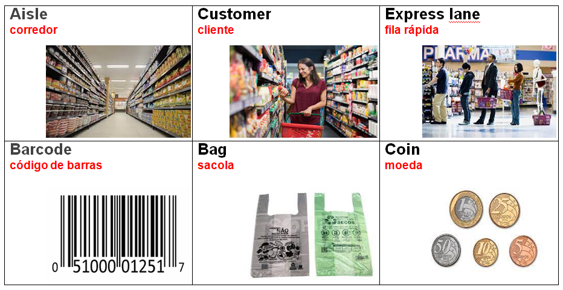

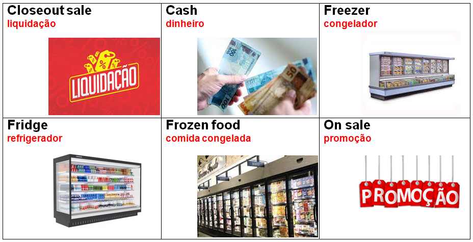

## Restaurant - Restaurante

**(en)** Below we will see some words related to restaurant, such as characters and items. <mark style="color:red;">**(br)**</mark> Abaixo veremos algumas palavras relacionadas a restaurante, como personagens e itens.

#### Characters - Personagens

<table><thead><tr><th width="150">English</th><th width="150">Português</th><th width="150">English</th><th>Português</th></tr></thead><tbody><tr><td>Waiter</td><td>Garçom</td><td>Kitchen assistant</td><td>Auxiliar de cozinha</td></tr><tr><td>Chef of kitchen</td><td>Chef de cozinha</td><td>Confectioner</td><td>Confeiteiro</td></tr><tr><td>Cooker</td><td>Cozinheiro</td><td>Bartender</td><td>Barman</td></tr></tbody></table>

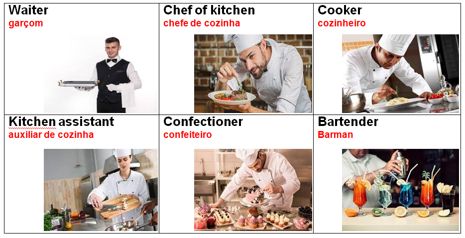

#### Items - Itens

<table><thead><tr><th width="150">English</th><th width="150">Português</th><th width="150">English</th><th>Português</th></tr></thead><tbody><tr><td>Fork, knife and spoon</td><td>Garfo, faca e colher</td><td>Nepkin</td><td>Guardanapo</td></tr><tr><td>Toothpick</td><td>Palito de dentes</td><td>Cutlery</td><td>Talheres</td></tr><tr><td>Matches</td><td>Fósforos</td><td>Straw</td><td>Canudinho</td></tr></tbody></table>

.png>)

## Hotel - Hotel

**(en)** Below, we will see some words related to hotel, such as characters and items.&#x20;

<mark style="color:red;">**(br)**</mark> Abaixo, veremos algumas palavras relacionadas a hotel, como personagens e itens.

#### Characters - Personagens

<table><thead><tr><th width="150">English</th><th width="197">Português</th><th width="200.2677376171352">English</th><th>Português</th></tr></thead><tbody><tr><td>Butler</td><td>Mordomo</td><td>Recptionist</td><td>Recepcionista</td></tr><tr><td>Supervision</td><td>Supervisor(a)</td><td>Concierge</td><td>Porteiro(a)</td></tr><tr><td>Room maid</td><td>Camareira </td><td>Messenger</td><td>Mensageiro(a)</td></tr></tbody></table>

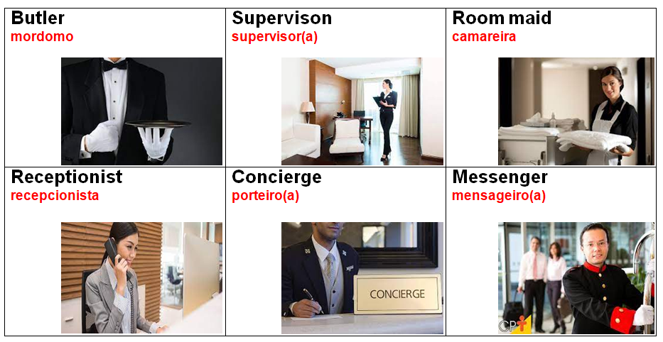

#### Items - Itens

<table><thead><tr><th width="150">English</th><th width="150">Português</th><th width="151.7142857142857">English</th><th>Português</th></tr></thead><tbody><tr><td>Alarm clock</td><td>Despertador</td><td>Food hall</td><td>Área de alimentação</td></tr><tr><td>Laundry</td><td>Lavanderia</td><td>Room services</td><td>Serviços de quarto</td></tr><tr><td>Taxi call</td><td>Chamada de táxi</td><td>Cleaning</td><td>Limpeza</td></tr></tbody></table>

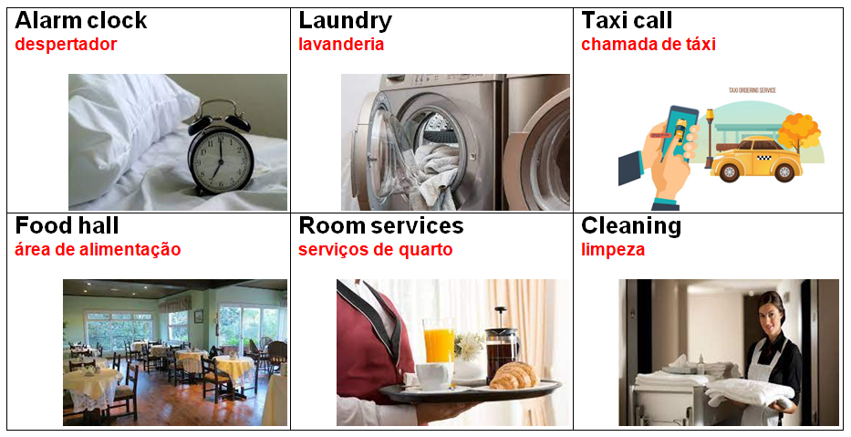

## Airport - Aeroporto

**(en)** Below, we will see some words related to airport, such as characters and items.&#x20;

<mark style="color:red;">**(br)**</mark> Abaixo, veremos algumas palavras relacionadas a aeroporto, como personagens e itens.

#### Characters - Personagens

<table><thead><tr><th width="150">English</th><th width="179.28571428571428">Português</th><th>English</th><th>Português</th></tr></thead><tbody><tr><td>Bilingual receptionist</td><td>Recepcionista bilíngue</td><td>Pilot</td><td>Piloto</td></tr><tr><td>Flight attendant</td><td>Comissário de voo</td><td>Steward</td><td>Aeromoça</td></tr><tr><td>Salesman</td><td>Vendedor</td><td>Passengers</td><td>Passageiros</td></tr></tbody></table>

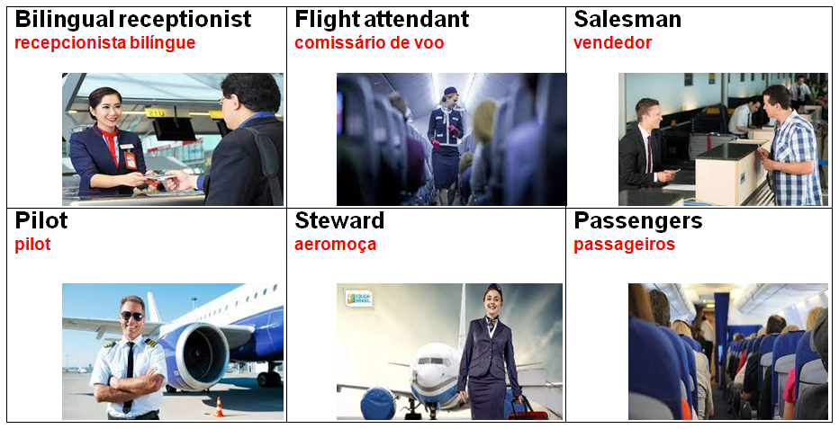

#### Items - Itens

<table><thead><tr><th width="200">English</th><th width="161">Português</th><th width="150">English</th><th>Português</th></tr></thead><tbody><tr><td>Tickets</td><td>Passagens</td><td>Sleeping mask</td><td>Máscara de dormir</td></tr><tr><td>Passports</td><td>Passaportes</td><td>Check in</td><td>Dar entrada</td></tr><tr><td>Armchairs</td><td>Poltronas</td><td>Check out</td><td>Verificação de saída</td></tr></tbody></table>

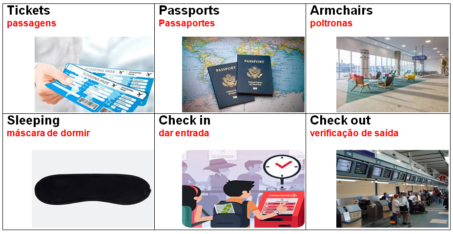

## Drugstore - Fármacia

**(en)** Below we will see some words related to drugstore, such as characters and items.&#x20;

<mark style="color:red;">**(br)**</mark> Abaixo veremos algumas palavras relacionadas a fármacia, como personagens e itens.

#### Characters - Personagens

<table><thead><tr><th width="150">English</th><th width="150">Português</th></tr></thead><tbody><tr><td>Pharmaceutical</td><td>Farmacêutico</td></tr><tr><td>Clerk</td><td>Balconista</td></tr><tr><td>Organizer</td><td>Organizador</td></tr><tr><td>Replenisher</td><td>Repositor</td></tr></tbody></table>

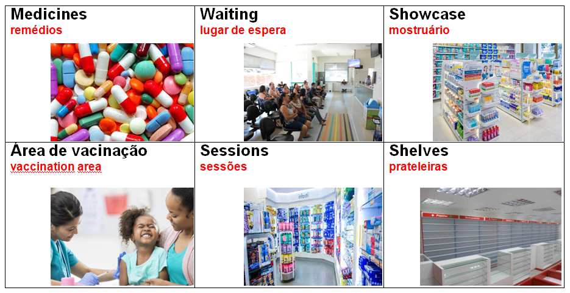

#### Items - Itens

<table><thead><tr><th width="150">English</th><th width="187">Português</th><th>English</th><th>Português</th></tr></thead><tbody><tr><td>Medicines</td><td>Remédios</td><td>Vaccination area</td><td>Área de vacinação</td></tr><tr><td>Waiting place</td><td>Lugar de espera</td><td>Sessions</td><td>Sessões</td></tr><tr><td>Showcase</td><td>Mostruário </td><td>Shelves</td><td>Prateleiras</td></tr></tbody></table>

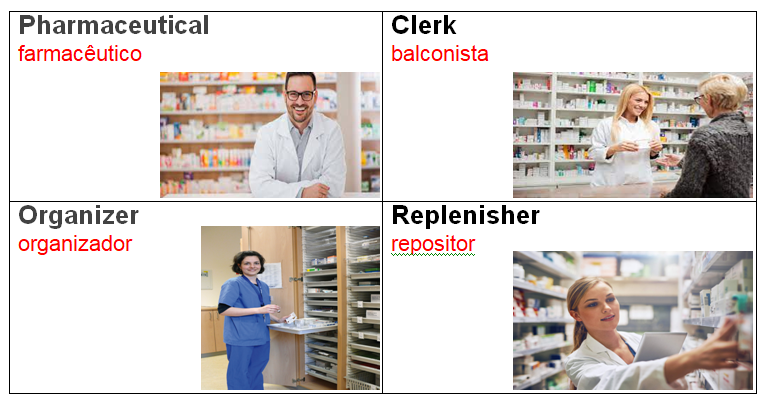

